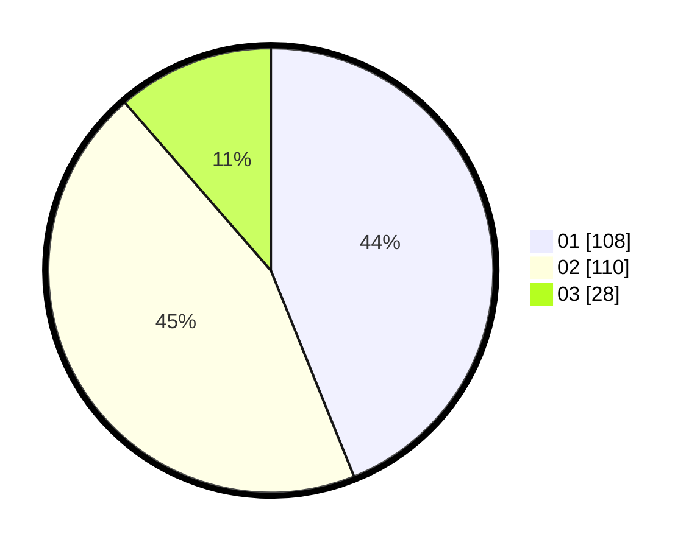

# Hasil

Hasil perolehan suara paslon dapat dilihat pada file paslon-01.txt, paslon-02.txt, dan paslon-03.txt.

Jika tidak ada, artinya data tersebut belum ada pada SIREKAP.

## Perolehan Suara

 * Paslon 01: **108**.
 * Paslon 02: **110**.
 * Paslon 03: **28**.

## Foto C Plano

https://sirekap-obj-formc.kpu.go.id/13f5/pemilu/ppwp/31/73/05/10/05/3173051005022-20240215-003554--186bb77f-a25a-4f6d-8e7f-3bc7ed22e0a5.jpg

https://sirekap-obj-formc.kpu.go.id/13f5/pemilu/ppwp/31/73/05/10/05/3173051005022-20240215-004150--d8155855-9995-46a9-963b-310361fe54c7.jpg
