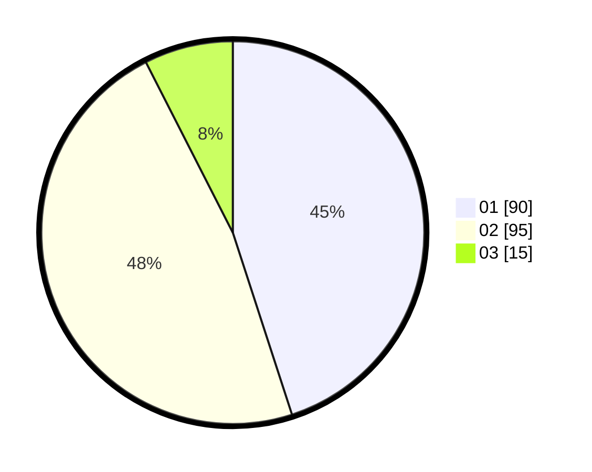

# Hasil

Hasil perolehan suara paslon dapat dilihat pada file paslon-01.txt, paslon-02.txt, dan paslon-03.txt.

Jika tidak ada, artinya data tersebut belum ada pada SIREKAP.

## Perolehan Suara

 * Paslon 01: **90**.
 * Paslon 02: **95**.
 * Paslon 03: **15**.

## Foto C Plano

https://sirekap-obj-formc.kpu.go.id/2f01/pemilu/ppwp/31/73/05/10/05/3173051005024-20240214-190826--7c8c4839-fc71-45b5-8d54-2dbd2bc99716.jpg

https://sirekap-obj-formc.kpu.go.id/2f01/pemilu/ppwp/31/73/05/10/05/3173051005024-20240214-212548--746aada6-43bd-4ac9-a646-b35bbd82390f.jpg

https://sirekap-obj-formc.kpu.go.id/2f01/pemilu/ppwp/31/73/05/10/05/3173051005024-20240214-190840--bb6bacdd-69f7-46d0-be9d-7d0da95879a6.jpg

## DATA PEMILIH TETAP

Jumlah pemilih dalam DPT: **278**.
 * L: **133**.
 * P: **145**.

## DATA PENGGUNA HAK PILIH

Jumlah pengguna hak pilih dalam DPT: **199**.
 * L: **94**.
 * P: **105**.

Jumlah pengguna hak pilih dalam DPTb: **0**.
 * L: **0**.
 * P: **0**.

Jumlah pengguna hak pilih dalam DPK: **1**.
 * L: **0**.
 * P: **1**.

Jumlah pengguna hak pilih: **200**.
 * L: **94**.
 * P: **106**.

## JUMLAH SUARA SAH DAN TIDAK SAH

JUMLAH SELURUH SUARA SAH: **200**.

JUMLAH SUARA TIDAK SAH: **0**.

JUMLAH SELURUH SUARA SAH DAN SUARA TIDAK SAH: **200**.
