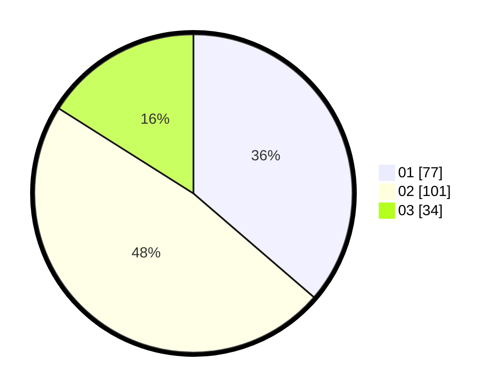

# Hasil

Hasil perolehan suara paslon dapat dilihat pada file paslon-01.txt, paslon-02.txt, dan paslon-03.txt.

Jika tidak ada, artinya data tersebut belum ada pada SIREKAP.

## Perolehan Suara

 * Paslon 01: **77**.
 * Paslon 02: **101**.
 * Paslon 03: **34**.

## Foto C Plano

https://sirekap-obj-formc.kpu.go.id/b142/pemilu/ppwp/31/73/05/10/05/3173051005025-20240214-214821--5b593268-b9a9-4c15-9a9a-4044929293f0.jpg

https://sirekap-obj-formc.kpu.go.id/b142/pemilu/ppwp/31/73/05/10/05/3173051005025-20240214-200408--c105efc9-f4f7-4eb4-a470-8052d8042734.jpg

https://sirekap-obj-formc.kpu.go.id/b142/pemilu/ppwp/31/73/05/10/05/3173051005025-20240214-214921--e31b487d-2e1e-47b5-963f-565994d9cb82.jpg

## DATA PEMILIH TETAP

Jumlah pemilih dalam DPT: **286**.
 * L: **139**.
 * P: **147**.

## DATA PENGGUNA HAK PILIH

Jumlah pengguna hak pilih dalam DPT: **202**.
 * L: **97**.
 * P: **105**.

Jumlah pengguna hak pilih dalam DPTb: **4**.
 * L: **2**.
 * P: **2**.

Jumlah pengguna hak pilih dalam DPK: **7**.
 * L: **4**.
 * P: **3**.

Jumlah pengguna hak pilih: **213**.
 * L: **103**.
 * P: **110**.

## JUMLAH SUARA SAH DAN TIDAK SAH

JUMLAH SELURUH SUARA SAH: **212**.

JUMLAH SUARA TIDAK SAH: **1**.

JUMLAH SELURUH SUARA SAH DAN SUARA TIDAK SAH: **213**.
