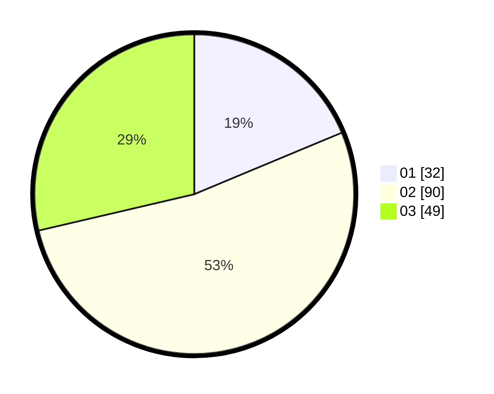

# Hasil

Hasil perolehan suara paslon dapat dilihat pada file paslon-01.txt, paslon-02.txt, dan paslon-03.txt.

Jika tidak ada, artinya data tersebut belum ada pada SIREKAP.

## Perolehan Suara

 * Paslon 01: **32**.
 * Paslon 02: **90**.
 * Paslon 03: **49**.

## Foto C Plano

https://sirekap-obj-formc.kpu.go.id/afcc/pemilu/ppwp/31/73/05/10/05/3173051005026-20240214-225402--e77a7a6b-2d6f-45aa-bb9b-9c44d49cc8be.jpg

https://sirekap-obj-formc.kpu.go.id/afcc/pemilu/ppwp/31/73/05/10/05/3173051005026-20240214-225515--0de8a31b-000b-4025-9990-fbfc8418a821.jpg

https://sirekap-obj-formc.kpu.go.id/afcc/pemilu/ppwp/31/73/05/10/05/3173051005026-20240214-225628--ac6fe60e-df28-4734-8c62-bf9f555fdb8a.jpg
