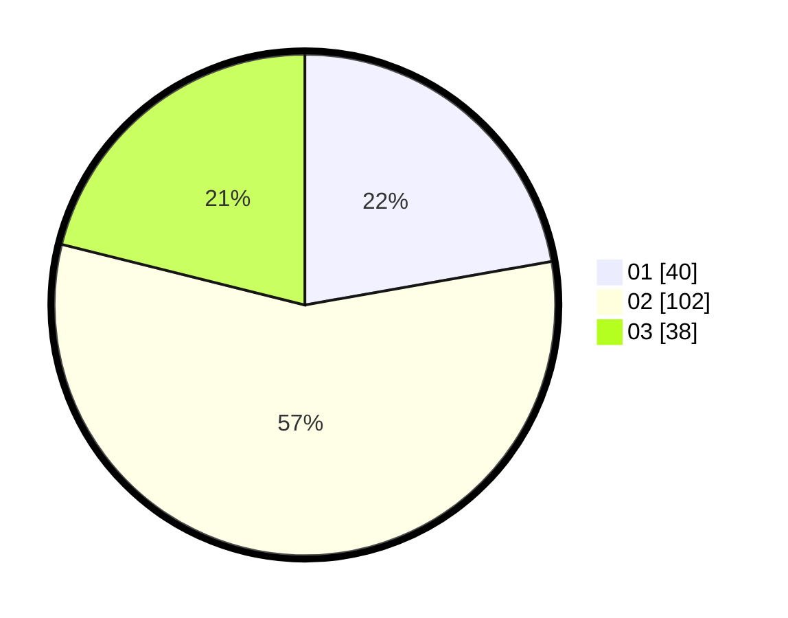

# Hasil

Hasil perolehan suara paslon dapat dilihat pada file paslon-01.txt, paslon-02.txt, dan paslon-03.txt.

Jika tidak ada, artinya data tersebut belum ada pada SIREKAP.

## Perolehan Suara

 * Paslon 01: **40**.
 * Paslon 02: **102**.
 * Paslon 03: **38**.

## Foto C Plano

https://sirekap-obj-formc.kpu.go.id/43b7/pemilu/ppwp/31/73/05/10/05/3173051005029-20240215-002728--b7c9df49-13e3-42ad-8ff7-ac8c1d2f7919.jpg

https://sirekap-obj-formc.kpu.go.id/43b7/pemilu/ppwp/31/73/05/10/05/3173051005029-20240215-002932--a8ba5088-9899-4022-94b7-bfd49c288216.jpg

https://sirekap-obj-formc.kpu.go.id/43b7/pemilu/ppwp/31/73/05/10/05/3173051005029-20240215-003019--8c5cec18-2a77-4808-9ce3-832d08d55cf0.jpg

## DATA PEMILIH TETAP

Jumlah pemilih dalam DPT: **275**.
 * L: **143**.
 * P: **132**.

## DATA PENGGUNA HAK PILIH

Jumlah pengguna hak pilih dalam DPT: **178**.
 * L: **87**.
 * P: **91**.

Jumlah pengguna hak pilih dalam DPTb: **0**.
 * L: **0**.
 * P: **0**.

Jumlah pengguna hak pilih dalam DPK: **4**.
 * L: **2**.
 * P: **2**.

Jumlah pengguna hak pilih: **182**.
 * L: **89**.
 * P: **93**.

## JUMLAH SUARA SAH DAN TIDAK SAH

JUMLAH SELURUH SUARA SAH: **180**.

JUMLAH SUARA TIDAK SAH: **2**.

JUMLAH SELURUH SUARA SAH DAN SUARA TIDAK SAH: **182**.
