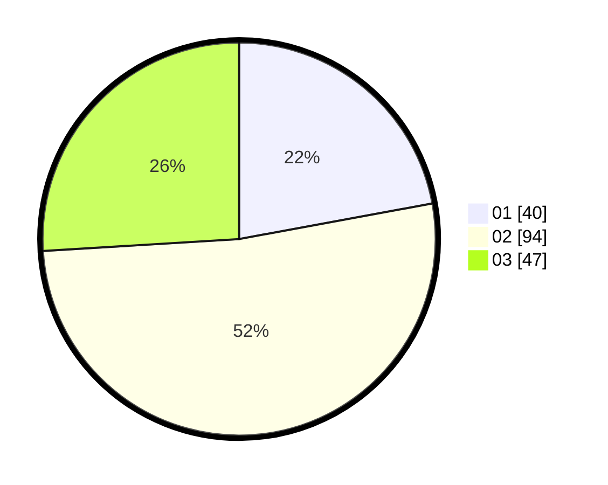

# Hasil

Hasil perolehan suara paslon dapat dilihat pada file paslon-01.txt, paslon-02.txt, dan paslon-03.txt.

Jika tidak ada, artinya data tersebut belum ada pada SIREKAP.

## Perolehan Suara

 * Paslon 01: **40**.
 * Paslon 02: **94**.
 * Paslon 03: **47**.

## Foto C Plano

https://sirekap-obj-formc.kpu.go.id/5acf/pemilu/ppwp/31/73/05/10/05/3173051005030-20240215-043135--6ca66138-a2e2-42d7-b846-3b9d059316ee.jpg

https://sirekap-obj-formc.kpu.go.id/5acf/pemilu/ppwp/31/73/05/10/05/3173051005030-20240215-043218--8af887c0-d521-4c08-9873-2c9ed725bb57.jpg

https://sirekap-obj-formc.kpu.go.id/5acf/pemilu/ppwp/31/73/05/10/05/3173051005030-20240215-043309--62196c48-3429-4a62-ba74-716d0c3deff0.jpg
