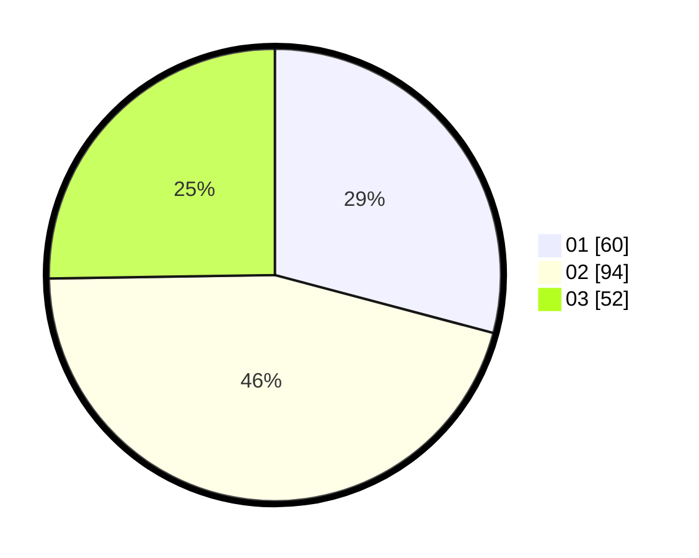

# Hasil

Hasil perolehan suara paslon dapat dilihat pada file paslon-01.txt, paslon-02.txt, dan paslon-03.txt.

Jika tidak ada, artinya data tersebut belum ada pada SIREKAP.

## Perolehan Suara

 * Paslon 01: **60**.
 * Paslon 02: **94**.
 * Paslon 03: **52**.

## Foto C Plano

https://sirekap-obj-formc.kpu.go.id/bdb7/pemilu/ppwp/31/73/05/10/05/3173051005031-20240215-024618--0d748215-f30b-48b9-8558-fac059347fd4.jpg

https://sirekap-obj-formc.kpu.go.id/bdb7/pemilu/ppwp/31/73/05/10/05/3173051005031-20240215-024750--74bba644-cefe-4f84-ae17-6c110d37539f.jpg

https://sirekap-obj-formc.kpu.go.id/bdb7/pemilu/ppwp/31/73/05/10/05/3173051005031-20240215-024844--ba5f6b4d-efb4-4567-b6d7-83ce13c87a2f.jpg
