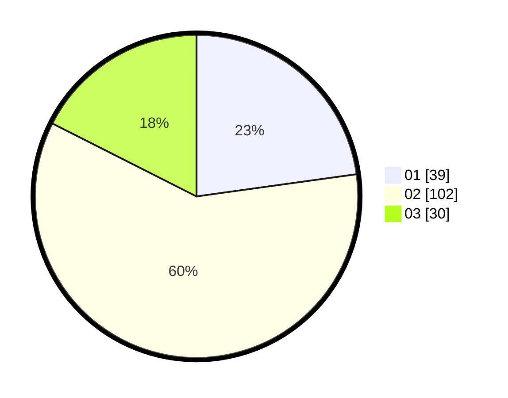

# Hasil

Hasil perolehan suara paslon dapat dilihat pada file paslon-01.txt, paslon-02.txt, dan paslon-03.txt.

Jika tidak ada, artinya data tersebut belum ada pada SIREKAP.

## Perolehan Suara

 * Paslon 01: **39**.
 * Paslon 02: **102**.
 * Paslon 03: **30**.

## Foto C Plano

https://sirekap-obj-formc.kpu.go.id/51d6/pemilu/ppwp/31/73/05/10/05/3173051005032-20240214-204100--42f7e7b5-6be9-4d64-a945-5739bc5e57ee.jpg

https://sirekap-obj-formc.kpu.go.id/51d6/pemilu/ppwp/31/73/05/10/05/3173051005032-20240215-004620--ed90461b-9cc0-4b8c-a0b2-d5bd052de344.jpg

https://sirekap-obj-formc.kpu.go.id/51d6/pemilu/ppwp/31/73/05/10/05/3173051005032-20240214-193627--eeb03386-f6d4-4191-bcda-634a982ab41f.jpg

## DATA PEMILIH TETAP

Jumlah pemilih dalam DPT: **280**.
 * L: **141**.
 * P: **139**.

## DATA PENGGUNA HAK PILIH

Jumlah pengguna hak pilih dalam DPT: **164**.
 * L: **75**.
 * P: **89**.

Jumlah pengguna hak pilih dalam DPTb: **9**.
 * L: **4**.
 * P: **5**.

Jumlah pengguna hak pilih dalam DPK: **2**.
 * L: **1**.
 * P: **1**.

Jumlah pengguna hak pilih: **175**.
 * L: **80**.
 * P: **95**.

## JUMLAH SUARA SAH DAN TIDAK SAH

JUMLAH SELURUH SUARA SAH: **171**.

JUMLAH SUARA TIDAK SAH: **4**.

JUMLAH SELURUH SUARA SAH DAN SUARA TIDAK SAH: **175**.
