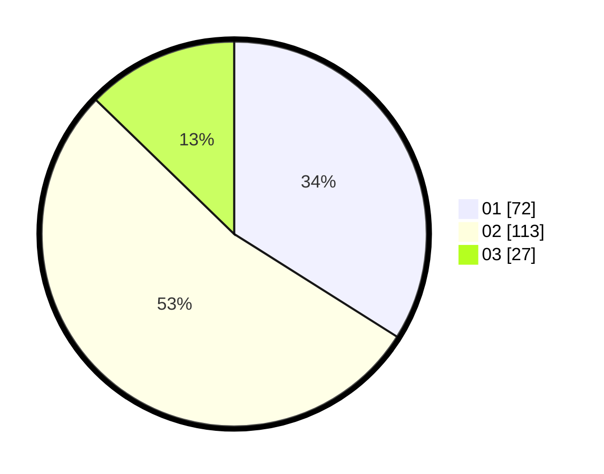

# Hasil

Hasil perolehan suara paslon dapat dilihat pada file paslon-01.txt, paslon-02.txt, dan paslon-03.txt.

Jika tidak ada, artinya data tersebut belum ada pada SIREKAP.

## Perolehan Suara

 * Paslon 01: **72**.
 * Paslon 02: **113**.
 * Paslon 03: **27**.

## Foto C Plano

https://sirekap-obj-formc.kpu.go.id/2321/pemilu/ppwp/31/73/05/10/05/3173051005034-20240214-212559--9af7bd5a-992d-40ca-ab9b-7018a582752d.jpg

https://sirekap-obj-formc.kpu.go.id/2321/pemilu/ppwp/31/73/05/10/05/3173051005034-20240214-213016--18084534-544b-469a-b4ac-4b77e0f8dc09.jpg

https://sirekap-obj-formc.kpu.go.id/2321/pemilu/ppwp/31/73/05/10/05/3173051005034-20240214-185658--15cb5d74-5399-4b30-a7cd-bf056057e4a1.jpg
