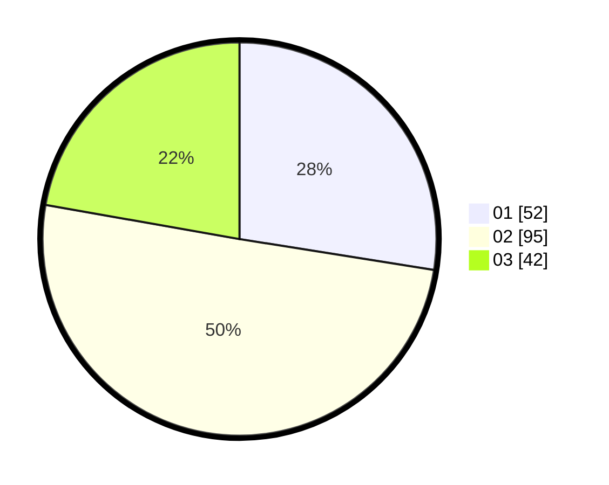

# Hasil

Hasil perolehan suara paslon dapat dilihat pada file paslon-01.txt, paslon-02.txt, dan paslon-03.txt.

Jika tidak ada, artinya data tersebut belum ada pada SIREKAP.

## Perolehan Suara

 * Paslon 01: **52**.
 * Paslon 02: **95**.
 * Paslon 03: **42**.

## Foto C Plano

https://sirekap-obj-formc.kpu.go.id/a506/pemilu/ppwp/31/73/05/10/05/3173051005036-20240214-194136--0e641436-64de-4f18-a30e-1601b68e4aa1.jpg

https://sirekap-obj-formc.kpu.go.id/a506/pemilu/ppwp/31/73/05/10/05/3173051005036-20240214-194321--dec9fc83-f733-4adb-8186-9ff9f0e634b1.jpg

https://sirekap-obj-formc.kpu.go.id/a506/pemilu/ppwp/31/73/05/10/05/3173051005036-20240214-194431--21967d7a-5caa-4a84-b1f5-e578d6fe8c81.jpg

## DATA PEMILIH TETAP

Jumlah pemilih dalam DPT: **258**.
 * L: **528**.
 * P: **430**.

## DATA PENGGUNA HAK PILIH

Jumlah pengguna hak pilih dalam DPT: **883**.
 * L: **83**.
 * P: **399**.

Jumlah pengguna hak pilih dalam DPTb: **20**.
 * L: **83**.
 * P: **807**.

Jumlah pengguna hak pilih dalam DPK: **1**.
 * L: **0**.
 * P: **6**.

Jumlah pengguna hak pilih: **594**.
 * L: **86**.
 * P: **698**.

## JUMLAH SUARA SAH DAN TIDAK SAH

JUMLAH SELURUH SUARA SAH: **190**.

JUMLAH SUARA TIDAK SAH: **4**.

JUMLAH SELURUH SUARA SAH DAN SUARA TIDAK SAH: **194**.
