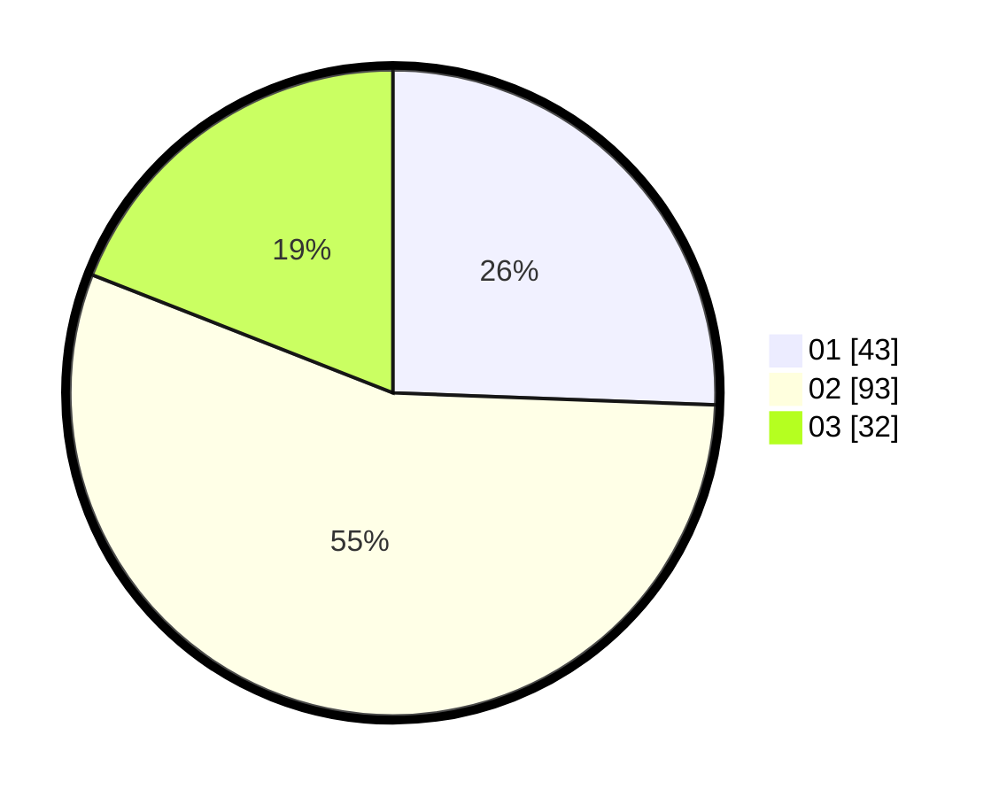

# Hasil

Hasil perolehan suara paslon dapat dilihat pada file paslon-01.txt, paslon-02.txt, dan paslon-03.txt.

Jika tidak ada, artinya data tersebut belum ada pada SIREKAP.

## Perolehan Suara

 * Paslon 01: **43**.
 * Paslon 02: **93**.
 * Paslon 03: **32**.

## Foto C Plano

https://sirekap-obj-formc.kpu.go.id/1446/pemilu/ppwp/31/73/05/10/05/3173051005037-20240215-033216--48cacc10-201b-4f51-acbc-0faf44183849.jpg

https://sirekap-obj-formc.kpu.go.id/1446/pemilu/ppwp/31/73/05/10/05/3173051005037-20240215-033318--82c13f2d-ffa1-4109-9c14-11b0d6343142.jpg

https://sirekap-obj-formc.kpu.go.id/1446/pemilu/ppwp/31/73/05/10/05/3173051005037-20240215-033400--fa8045c7-edda-4642-a968-9997959bdde3.jpg

## DATA PEMILIH TETAP

Jumlah pemilih dalam DPT: **238**.
 * L: **110**.
 * P: **128**.

## DATA PENGGUNA HAK PILIH

Jumlah pengguna hak pilih dalam DPT: **163**.
 * L: **73**.
 * P: **90**.

Jumlah pengguna hak pilih dalam DPTb: **2**.
 * L: **1**.
 * P: **1**.

Jumlah pengguna hak pilih dalam DPK: **4**.
 * L: **1**.
 * P: **3**.

Jumlah pengguna hak pilih: **169**.
 * L: **75**.
 * P: **93**.

## JUMLAH SUARA SAH DAN TIDAK SAH

JUMLAH SELURUH SUARA SAH: **168**.

JUMLAH SUARA TIDAK SAH: **1**.

JUMLAH SELURUH SUARA SAH DAN SUARA TIDAK SAH: **169**.
