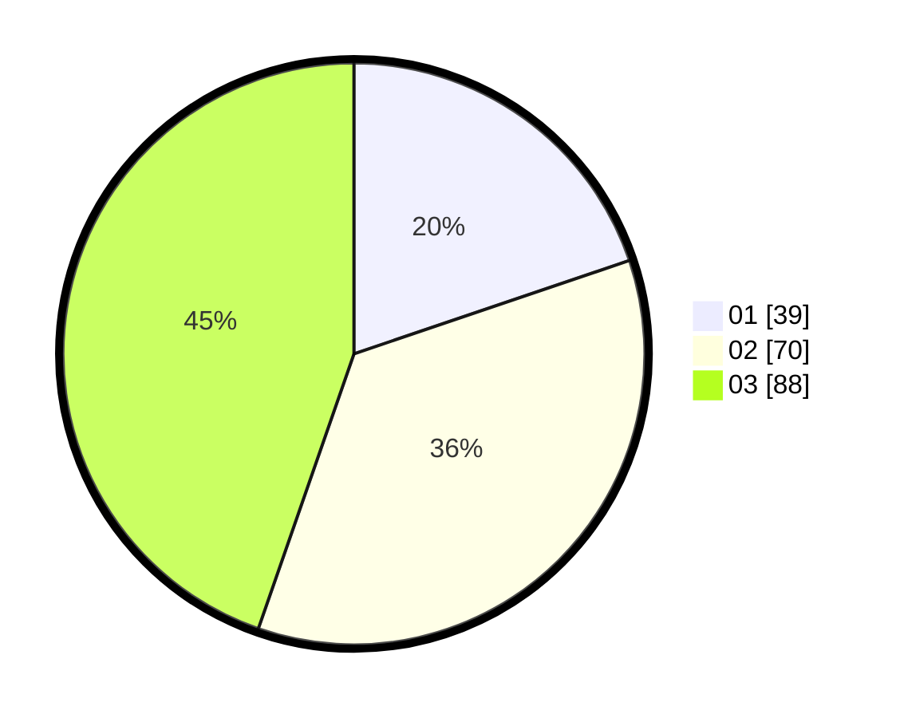

# Hasil

Hasil perolehan suara paslon dapat dilihat pada file paslon-01.txt, paslon-02.txt, dan paslon-03.txt.

Jika tidak ada, artinya data tersebut belum ada pada SIREKAP.

## Perolehan Suara

 * Paslon 01: **39**.
 * Paslon 02: **70**.
 * Paslon 03: **88**.

## Foto C Plano

https://sirekap-obj-formc.kpu.go.id/9f04/pemilu/ppwp/31/73/05/10/05/3173051005040-20240215-015807--1461031f-8e8a-4474-8b47-0fff9efa6c01.jpg

https://sirekap-obj-formc.kpu.go.id/9f04/pemilu/ppwp/31/73/05/10/05/3173051005040-20240215-015907--f0093082-01dd-4fc4-a575-836cc31f44db.jpg

https://sirekap-obj-formc.kpu.go.id/9f04/pemilu/ppwp/31/73/05/10/05/3173051005040-20240215-015956--658a10cd-5f63-4f9f-b2a7-ba401e771e5b.jpg

## DATA PEMILIH TETAP

Jumlah pemilih dalam DPT: **283**.
 * L: **143**.
 * P: **140**.

## DATA PENGGUNA HAK PILIH

Jumlah pengguna hak pilih dalam DPT: **191**.
 * L: **93**.
 * P: **98**.

Jumlah pengguna hak pilih dalam DPTb: **5**.
 * L: **2**.
 * P: **3**.

Jumlah pengguna hak pilih dalam DPK: **2**.
 * L: **1**.
 * P: **1**.

Jumlah pengguna hak pilih: **198**.
 * L: **96**.
 * P: **102**.

## JUMLAH SUARA SAH DAN TIDAK SAH

JUMLAH SELURUH SUARA SAH: **197**.

JUMLAH SUARA TIDAK SAH: **1**.

JUMLAH SELURUH SUARA SAH DAN SUARA TIDAK SAH: **198**.
