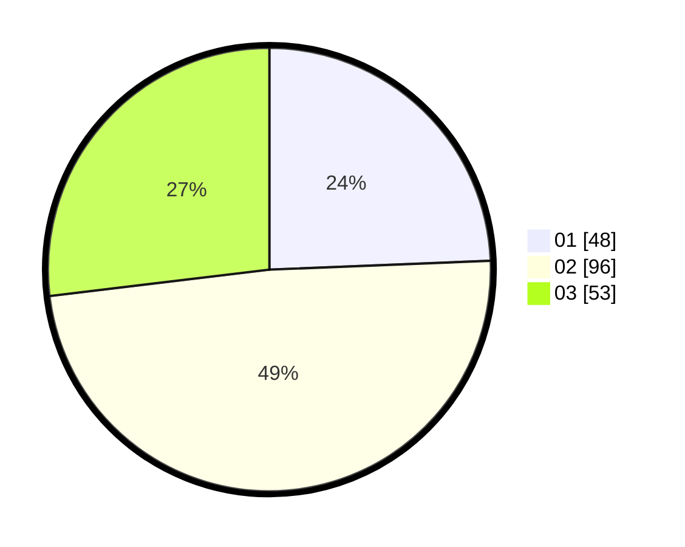

# Hasil

Hasil perolehan suara paslon dapat dilihat pada file paslon-01.txt, paslon-02.txt, dan paslon-03.txt.

Jika tidak ada, artinya data tersebut belum ada pada SIREKAP.

## Perolehan Suara

 * Paslon 01: **48**.
 * Paslon 02: **96**.
 * Paslon 03: **53**.

## Foto C Plano

https://sirekap-obj-formc.kpu.go.id/55fb/pemilu/ppwp/31/73/05/10/05/3173051005041-20240214-222056--fde9fc42-a978-4336-8f4f-46c0d5f2abab.jpg

https://sirekap-obj-formc.kpu.go.id/55fb/pemilu/ppwp/31/73/05/10/05/3173051005041-20240214-222227--e193edcf-0e8f-4322-920a-9d6521279827.jpg

https://sirekap-obj-formc.kpu.go.id/55fb/pemilu/ppwp/31/73/05/10/05/3173051005041-20240214-211459--c14f7264-86bb-4c38-8a6f-b39829446f6a.jpg
