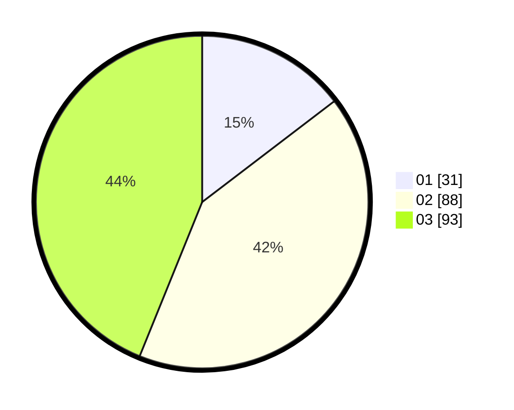

# Hasil

Hasil perolehan suara paslon dapat dilihat pada file paslon-01.txt, paslon-02.txt, dan paslon-03.txt.

Jika tidak ada, artinya data tersebut belum ada pada SIREKAP.

## Perolehan Suara

 * Paslon 01: **31**.
 * Paslon 02: **88**.
 * Paslon 03: **93**.

## Foto C Plano

https://sirekap-obj-formc.kpu.go.id/35b9/pemilu/ppwp/31/73/05/10/05/3173051005042-20240214-185143--52fb7a77-66ee-4791-88bf-f08f79b40266.jpg

https://sirekap-obj-formc.kpu.go.id/35b9/pemilu/ppwp/31/73/05/10/05/3173051005042-20240214-185320--c7f928bb-9a2b-463d-9f67-6a6323cbf528.jpg

https://sirekap-obj-formc.kpu.go.id/35b9/pemilu/ppwp/31/73/05/10/05/3173051005042-20240214-185421--467db346-0029-4979-ae24-771baf30fbd1.jpg

## DATA PEMILIH TETAP

Jumlah pemilih dalam DPT: **293**.
 * L: **135**.
 * P: **158**.

## DATA PENGGUNA HAK PILIH

Jumlah pengguna hak pilih dalam DPT: **214**.
 * L: **99**.
 * P: **115**.

Jumlah pengguna hak pilih dalam DPTb: **0**.
 * L: **0**.
 * P: **0**.

Jumlah pengguna hak pilih dalam DPK: **3**.
 * L: **3**.
 * P: **0**.

Jumlah pengguna hak pilih: **217**.
 * L: **102**.
 * P: **115**.

## JUMLAH SUARA SAH DAN TIDAK SAH

JUMLAH SELURUH SUARA SAH: **212**.

JUMLAH SUARA TIDAK SAH: **5**.

JUMLAH SELURUH SUARA SAH DAN SUARA TIDAK SAH: **217**.
