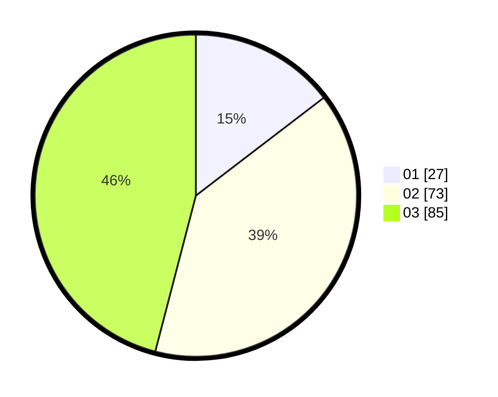

# Hasil

Hasil perolehan suara paslon dapat dilihat pada file paslon-01.txt, paslon-02.txt, dan paslon-03.txt.

Jika tidak ada, artinya data tersebut belum ada pada SIREKAP.

## Perolehan Suara

 * Paslon 01: **27**.
 * Paslon 02: **73**.
 * Paslon 03: **85**.

## Foto C Plano

https://sirekap-obj-formc.kpu.go.id/01eb/pemilu/ppwp/31/73/05/10/05/3173051005044-20240214-155529--3347516e-2657-4ded-8656-aefcc7d26e52.jpg

https://sirekap-obj-formc.kpu.go.id/01eb/pemilu/ppwp/31/73/05/10/05/3173051005044-20240214-155554--acdac89b-53de-447c-b8cd-8d1b6e7b9baa.jpg

https://sirekap-obj-formc.kpu.go.id/01eb/pemilu/ppwp/31/73/05/10/05/3173051005044-20240214-155615--89f89953-c0bf-4008-8883-4919dafcf76b.jpg

## DATA PEMILIH TETAP

Jumlah pemilih dalam DPT: **288**.
 * L: **140**.
 * P: **148**.

## DATA PENGGUNA HAK PILIH

Jumlah pengguna hak pilih dalam DPT: **183**.
 * L: **88**.
 * P: **95**.

Jumlah pengguna hak pilih dalam DPTb: **0**.
 * L: **0**.
 * P: **0**.

Jumlah pengguna hak pilih dalam DPK: **2**.
 * L: **1**.
 * P: **1**.

Jumlah pengguna hak pilih: **185**.
 * L: **89**.
 * P: **96**.

## JUMLAH SUARA SAH DAN TIDAK SAH

JUMLAH SELURUH SUARA SAH: **185**.

JUMLAH SUARA TIDAK SAH: **0**.

JUMLAH SELURUH SUARA SAH DAN SUARA TIDAK SAH: **185**.
