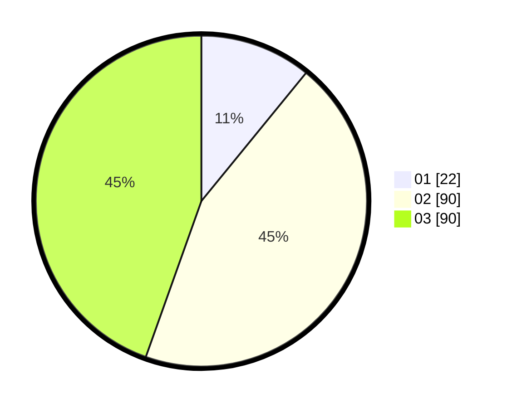

# Hasil

Hasil perolehan suara paslon dapat dilihat pada file paslon-01.txt, paslon-02.txt, dan paslon-03.txt.

Jika tidak ada, artinya data tersebut belum ada pada SIREKAP.

## Perolehan Suara

 * Paslon 01: **22**.
 * Paslon 02: **90**.
 * Paslon 03: **90**.

## Foto C Plano

https://sirekap-obj-formc.kpu.go.id/ddcd/pemilu/ppwp/31/73/05/10/05/3173051005045-20240214-193753--53e2c330-eb57-4a58-aa16-74c2f16a6210.jpg

https://sirekap-obj-formc.kpu.go.id/ddcd/pemilu/ppwp/31/73/05/10/05/3173051005045-20240214-210125--4946e24b-46c4-4994-8496-8f182df62565.jpg

https://sirekap-obj-formc.kpu.go.id/ddcd/pemilu/ppwp/31/73/05/10/05/3173051005045-20240214-194206--89874c50-39f2-404c-b844-07e43e4aa94b.jpg
