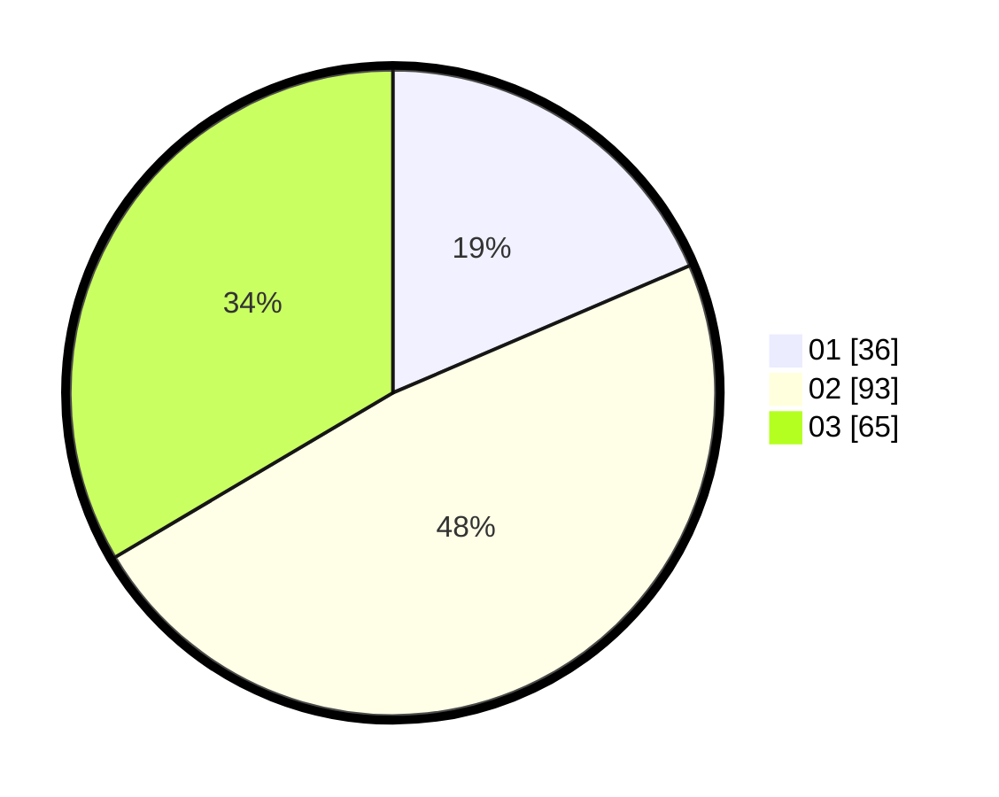

# Hasil

Hasil perolehan suara paslon dapat dilihat pada file paslon-01.txt, paslon-02.txt, dan paslon-03.txt.

Jika tidak ada, artinya data tersebut belum ada pada SIREKAP.

## Perolehan Suara

 * Paslon 01: **36**.
 * Paslon 02: **93**.
 * Paslon 03: **65**.

## Foto C Plano

https://sirekap-obj-formc.kpu.go.id/5648/pemilu/ppwp/31/73/05/10/05/3173051005050-20240214-231625--b43b1586-07d3-445c-aa5f-29be7f4b2921.jpg

https://sirekap-obj-formc.kpu.go.id/5648/pemilu/ppwp/31/73/05/10/05/3173051005050-20240214-231719--b59f7b92-26b0-44eb-a5c9-fc90824415f2.jpg

https://sirekap-obj-formc.kpu.go.id/5648/pemilu/ppwp/31/73/05/10/05/3173051005050-20240214-231808--ac5c62c9-813c-42d2-b159-4db74fc04be6.jpg

## DATA PEMILIH TETAP

Jumlah pemilih dalam DPT: **281**.
 * L: **143**.
 * P: **138**.

## DATA PENGGUNA HAK PILIH

Jumlah pengguna hak pilih dalam DPT: **197**.
 * L: **97**.
 * P: **100**.

Jumlah pengguna hak pilih dalam DPTb: **0**.
 * L: **0**.
 * P: **0**.

Jumlah pengguna hak pilih dalam DPK: **0**.
 * L: **0**.
 * P: **0**.

Jumlah pengguna hak pilih: **197**.
 * L: **97**.
 * P: **100**.

## JUMLAH SUARA SAH DAN TIDAK SAH

JUMLAH SELURUH SUARA SAH: **194**.

JUMLAH SUARA TIDAK SAH: **3**.

JUMLAH SELURUH SUARA SAH DAN SUARA TIDAK SAH: **197**.
