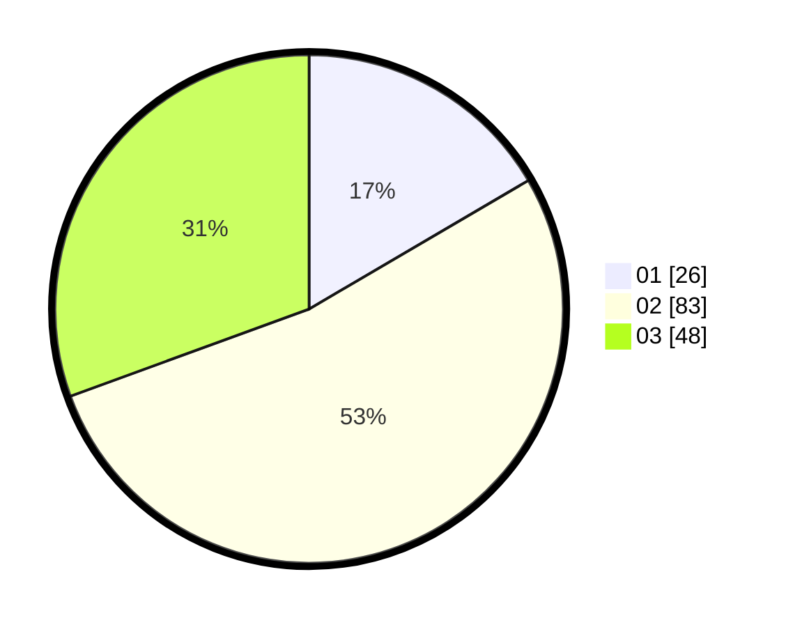

# Hasil

Hasil perolehan suara paslon dapat dilihat pada file paslon-01.txt, paslon-02.txt, dan paslon-03.txt.

Jika tidak ada, artinya data tersebut belum ada pada SIREKAP.

## Perolehan Suara

 * Paslon 01: **26**.
 * Paslon 02: **83**.
 * Paslon 03: **48**.

## Foto C Plano

https://sirekap-obj-formc.kpu.go.id/2b19/pemilu/ppwp/31/73/05/10/05/3173051005051-20240214-155849--13b54bd4-77c6-4dd2-bf4a-11b2a7cd832f.jpg

https://sirekap-obj-formc.kpu.go.id/2b19/pemilu/ppwp/31/73/05/10/05/3173051005051-20240214-160116--3dcfa9fe-0a9b-4330-abd3-b54c3f22a7bf.jpg

https://sirekap-obj-formc.kpu.go.id/2b19/pemilu/ppwp/31/73/05/10/05/3173051005051-20240214-160146--a3f46f60-fd01-4a8b-860e-ee86444565df.jpg

## DATA PEMILIH TETAP

Jumlah pemilih dalam DPT: **246**.
 * L: **119**.
 * P: **127**.

## DATA PENGGUNA HAK PILIH

Jumlah pengguna hak pilih dalam DPT: **160**.
 * L: **75**.
 * P: **85**.

Jumlah pengguna hak pilih dalam DPTb: **0**.
 * L: **0**.
 * P: **0**.

Jumlah pengguna hak pilih dalam DPK: **2**.
 * L: **0**.
 * P: **2**.

Jumlah pengguna hak pilih: **162**.
 * L: **75**.
 * P: **87**.

## JUMLAH SUARA SAH DAN TIDAK SAH

JUMLAH SELURUH SUARA SAH: **157**.

JUMLAH SUARA TIDAK SAH: **5**.

JUMLAH SELURUH SUARA SAH DAN SUARA TIDAK SAH: **162**.
