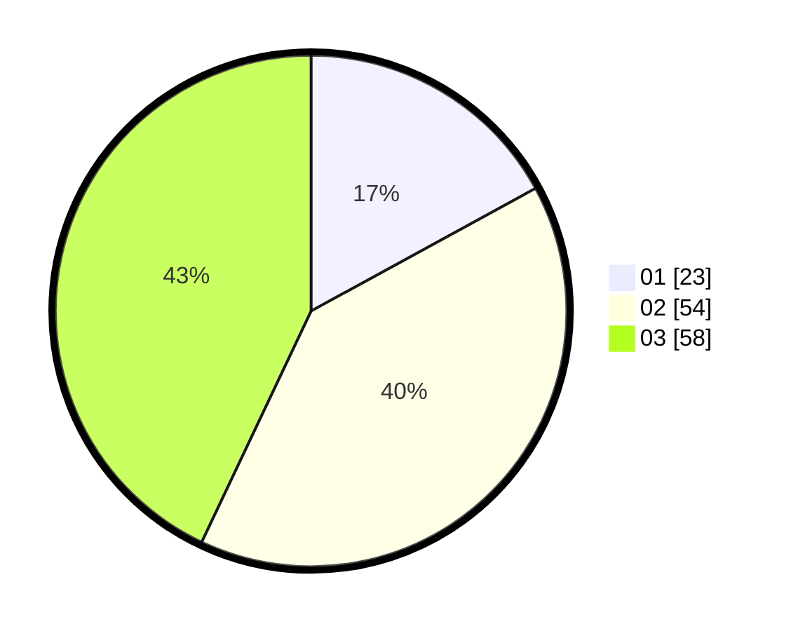

# Hasil

Hasil perolehan suara paslon dapat dilihat pada file paslon-01.txt, paslon-02.txt, dan paslon-03.txt.

Jika tidak ada, artinya data tersebut belum ada pada SIREKAP.

## Perolehan Suara

 * Paslon 01: **23**.
 * Paslon 02: **54**.
 * Paslon 03: **58**.

## Foto C Plano

https://sirekap-obj-formc.kpu.go.id/0854/pemilu/ppwp/31/73/05/10/05/3173051005052-20240214-220817--11f62531-f601-4c0f-99b8-2eb414cef40c.jpg

https://sirekap-obj-formc.kpu.go.id/0854/pemilu/ppwp/31/73/05/10/05/3173051005052-20240214-221217--5504f97c-5b16-4f74-befd-24dfbf11f2c3.jpg

https://sirekap-obj-formc.kpu.go.id/0854/pemilu/ppwp/31/73/05/10/05/3173051005052-20240214-221344--0ad6efbc-8e81-487c-90c9-473837069620.jpg

## DATA PEMILIH TETAP

Jumlah pemilih dalam DPT: **235**.
 * L: **115**.
 * P: **120**.

## DATA PENGGUNA HAK PILIH

Jumlah pengguna hak pilih dalam DPT: **136**.
 * L: **63**.
 * P: **73**.

Jumlah pengguna hak pilih dalam DPTb: **0**.
 * L: **0**.
 * P: **0**.

Jumlah pengguna hak pilih dalam DPK: **0**.
 * L: **0**.
 * P: **0**.

Jumlah pengguna hak pilih: **136**.
 * L: **63**.
 * P: **73**.

## JUMLAH SUARA SAH DAN TIDAK SAH

JUMLAH SELURUH SUARA SAH: **135**.

JUMLAH SUARA TIDAK SAH: **1**.

JUMLAH SELURUH SUARA SAH DAN SUARA TIDAK SAH: **136**.
