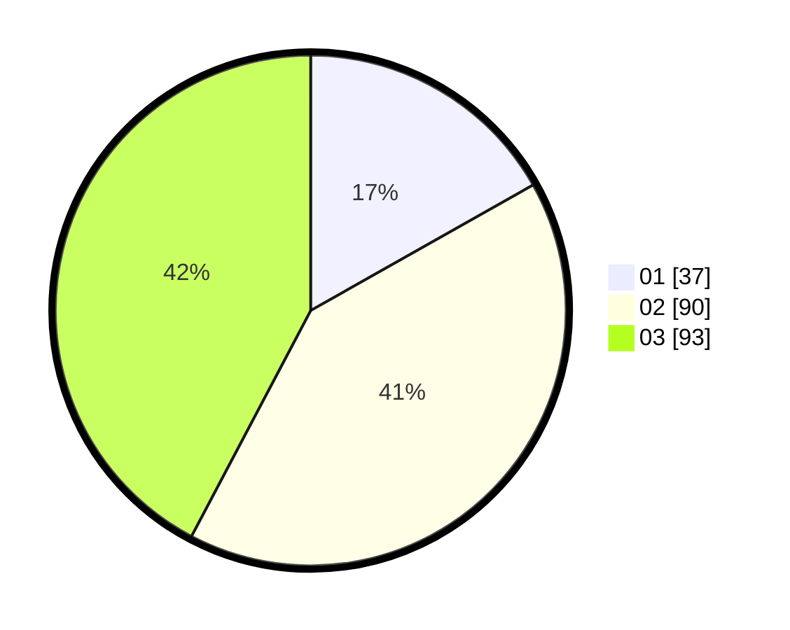

# Hasil

Hasil perolehan suara paslon dapat dilihat pada file paslon-01.txt, paslon-02.txt, dan paslon-03.txt.

Jika tidak ada, artinya data tersebut belum ada pada SIREKAP.

## Perolehan Suara

 * Paslon 01: **37**.
 * Paslon 02: **90**.
 * Paslon 03: **93**.

## Foto C Plano

https://sirekap-obj-formc.kpu.go.id/4400/pemilu/ppwp/31/73/05/10/05/3173051005053-20240215-022759--b7624a7d-9f15-4556-af23-08f4115ebce7.jpg

https://sirekap-obj-formc.kpu.go.id/4400/pemilu/ppwp/31/73/05/10/05/3173051005053-20240215-022724--0fcc6f66-8b3d-481b-a1f2-57c1cd23891c.jpg

https://sirekap-obj-formc.kpu.go.id/4400/pemilu/ppwp/31/73/05/10/05/3173051005053-20240215-022637--c5b1754f-32e3-4cac-a000-caa543539a45.jpg
