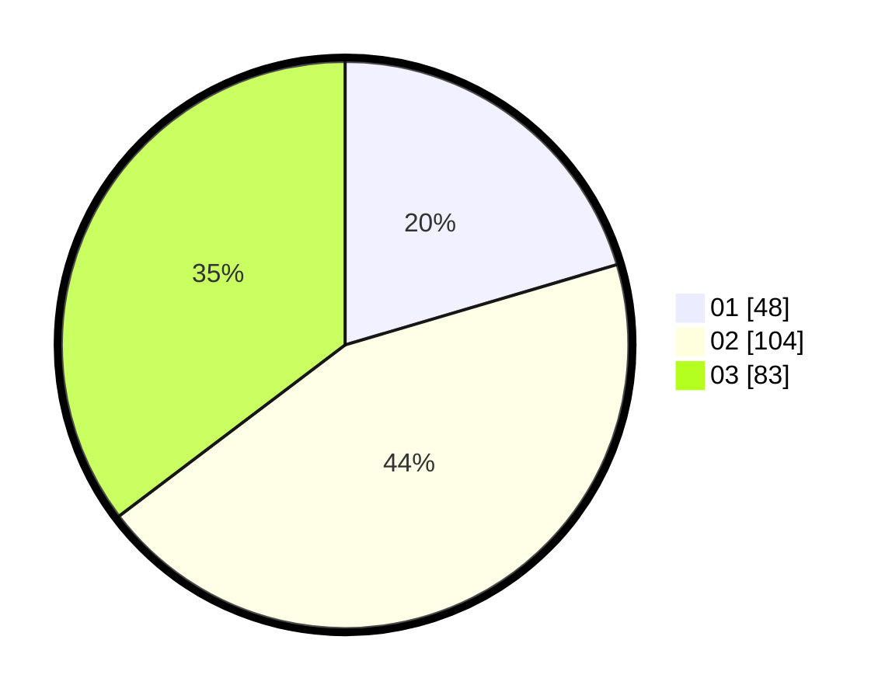

# Hasil

Hasil perolehan suara paslon dapat dilihat pada file paslon-01.txt, paslon-02.txt, dan paslon-03.txt.

Jika tidak ada, artinya data tersebut belum ada pada SIREKAP.

## Perolehan Suara

 * Paslon 01: **48**.
 * Paslon 02: **104**.
 * Paslon 03: **83**.

## Foto C Plano

https://sirekap-obj-formc.kpu.go.id/0e90/pemilu/ppwp/31/73/05/10/05/3173051005054-20240215-021418--5c4b07a6-281a-42bf-ac2e-86ea8b025a2e.jpg

https://sirekap-obj-formc.kpu.go.id/0e90/pemilu/ppwp/31/73/05/10/05/3173051005054-20240215-021628--b0bdbed0-ddae-4f70-b367-c7a016cf8215.jpg

https://sirekap-obj-formc.kpu.go.id/0e90/pemilu/ppwp/31/73/05/10/05/3173051005054-20240215-024802--9c63a1ae-e3c7-4dd2-8084-654111044742.jpg
