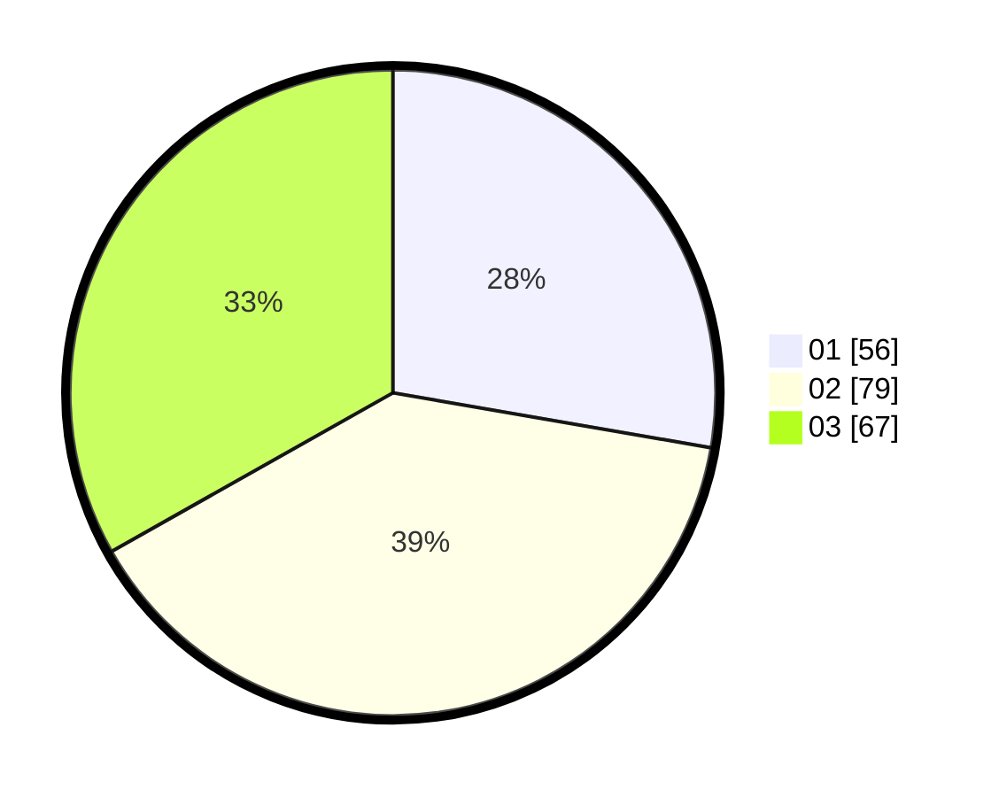

# Hasil

Hasil perolehan suara paslon dapat dilihat pada file paslon-01.txt, paslon-02.txt, dan paslon-03.txt.

Jika tidak ada, artinya data tersebut belum ada pada SIREKAP.

## Perolehan Suara

 * Paslon 01: **56**.
 * Paslon 02: **79**.
 * Paslon 03: **67**.

## Foto C Plano

https://sirekap-obj-formc.kpu.go.id/2c7b/pemilu/ppwp/31/73/05/10/05/3173051005055-20240215-024052--82be24f1-6d35-4651-8ef7-56e1470dc828.jpg

https://sirekap-obj-formc.kpu.go.id/2c7b/pemilu/ppwp/31/73/05/10/05/3173051005055-20240215-024313--ff15ad84-50ef-4589-bcd7-daaa9b884ba0.jpg

https://sirekap-obj-formc.kpu.go.id/2c7b/pemilu/ppwp/31/73/05/10/05/3173051005055-20240215-024431--01ebb52c-fb76-4e0e-9386-a6f62f69eaf0.jpg
