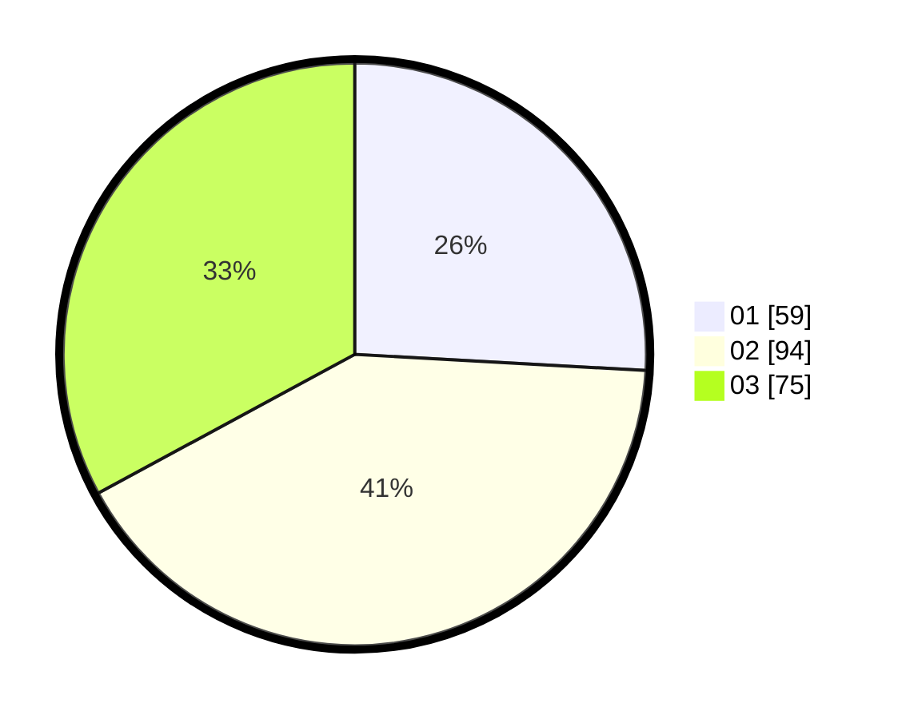

# Hasil

Hasil perolehan suara paslon dapat dilihat pada file paslon-01.txt, paslon-02.txt, dan paslon-03.txt.

Jika tidak ada, artinya data tersebut belum ada pada SIREKAP.

## Perolehan Suara

 * Paslon 01: **59**.
 * Paslon 02: **94**.
 * Paslon 03: **75**.

## Foto C Plano

https://sirekap-obj-formc.kpu.go.id/8161/pemilu/ppwp/31/73/05/10/05/3173051005057-20240214-155126--5c2feebf-842e-49e2-904b-248db09d848d.jpg

https://sirekap-obj-formc.kpu.go.id/8161/pemilu/ppwp/31/73/05/10/05/3173051005057-20240214-155348--1f23079f-9399-4791-8391-b2110eaac9bb.jpg

https://sirekap-obj-formc.kpu.go.id/8161/pemilu/ppwp/31/73/05/10/05/3173051005057-20240214-192452--d66f7c54-52b9-4d51-9275-6c91ae41fb0d.jpg

## DATA PEMILIH TETAP

Jumlah pemilih dalam DPT: **290**.
 * L: **148**.
 * P: **142**.

## DATA PENGGUNA HAK PILIH

Jumlah pengguna hak pilih dalam DPT: **220**.
 * L: **104**.
 * P: **116**.

Jumlah pengguna hak pilih dalam DPTb: **4**.
 * L: **2**.
 * P: **2**.

Jumlah pengguna hak pilih dalam DPK: **9**.
 * L: **4**.
 * P: **5**.

Jumlah pengguna hak pilih: **233**.
 * L: **110**.
 * P: **123**.

## JUMLAH SUARA SAH DAN TIDAK SAH

JUMLAH SELURUH SUARA SAH: **228**.

JUMLAH SUARA TIDAK SAH: **5**.

JUMLAH SELURUH SUARA SAH DAN SUARA TIDAK SAH: **233**.
