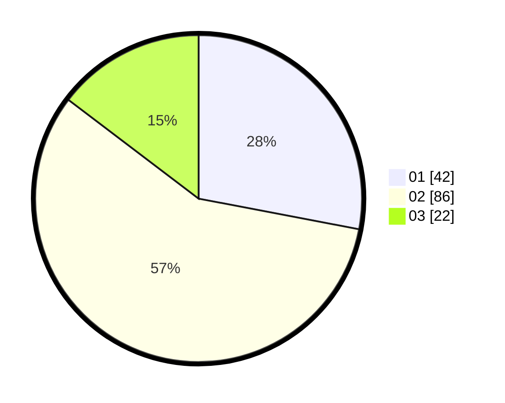

# Hasil

Hasil perolehan suara paslon dapat dilihat pada file paslon-01.txt, paslon-02.txt, dan paslon-03.txt.

Jika tidak ada, artinya data tersebut belum ada pada SIREKAP.

## Perolehan Suara

 * Paslon 01: **42**.
 * Paslon 02: **86**.
 * Paslon 03: **22**.

## Foto C Plano

https://sirekap-obj-formc.kpu.go.id/5f9a/pemilu/ppwp/31/73/05/10/05/3173051005070-20240214-205338--58aada36-9201-4fc7-9e28-e3a3525a8417.jpg

https://sirekap-obj-formc.kpu.go.id/5f9a/pemilu/ppwp/31/73/05/10/05/3173051005070-20240214-224115--23cc1c79-ef6f-49fe-b8be-e640c088a2f5.jpg

https://sirekap-obj-formc.kpu.go.id/5f9a/pemilu/ppwp/31/73/05/10/05/3173051005070-20240214-220046--6da734c6-0016-4eaf-b770-f6819a70e04b.jpg
