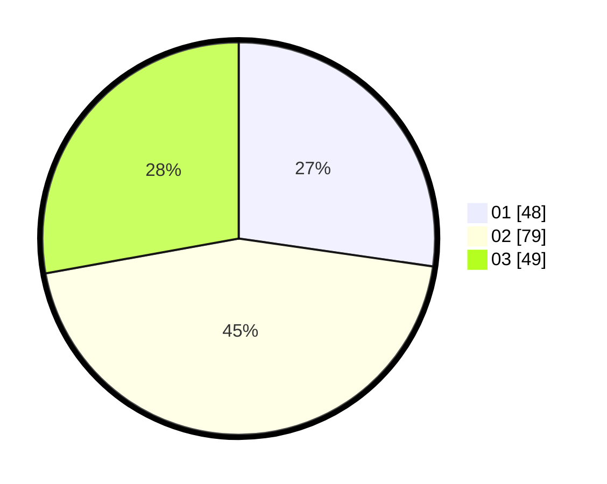

# Hasil

Hasil perolehan suara paslon dapat dilihat pada file paslon-01.txt, paslon-02.txt, dan paslon-03.txt.

Jika tidak ada, artinya data tersebut belum ada pada SIREKAP.

## Perolehan Suara

 * Paslon 01: **48**.
 * Paslon 02: **79**.
 * Paslon 03: **49**.

## Foto C Plano

https://sirekap-obj-formc.kpu.go.id/df87/pemilu/ppwp/31/73/05/10/05/3173051005071-20240216-092053--a6fe54c5-c122-4a3f-befe-ebf5a11581a9.jpg

https://sirekap-obj-formc.kpu.go.id/df87/pemilu/ppwp/31/73/05/10/05/3173051005071-20240214-213125--a8ed3766-ae39-460e-bd9f-b337bdc9cde6.jpg

https://sirekap-obj-formc.kpu.go.id/df87/pemilu/ppwp/31/73/05/10/05/3173051005071-20240214-213656--24657f87-9133-42f5-8894-ea677b22f079.jpg

## DATA PEMILIH TETAP

Jumlah pemilih dalam DPT: **240**.
 * L: **126**.
 * P: **114**.

## DATA PENGGUNA HAK PILIH

Jumlah pengguna hak pilih dalam DPT: **174**.
 * L: **85**.
 * P: **89**.

Jumlah pengguna hak pilih dalam DPTb: **2**.
 * L: **0**.
 * P: **2**.

Jumlah pengguna hak pilih dalam DPK: **0**.
 * L: **0**.
 * P: **0**.

Jumlah pengguna hak pilih: **176**.
 * L: **85**.
 * P: **91**.

## JUMLAH SUARA SAH DAN TIDAK SAH

JUMLAH SELURUH SUARA SAH: **176**.

JUMLAH SUARA TIDAK SAH: **0**.

JUMLAH SELURUH SUARA SAH DAN SUARA TIDAK SAH: **176**.
