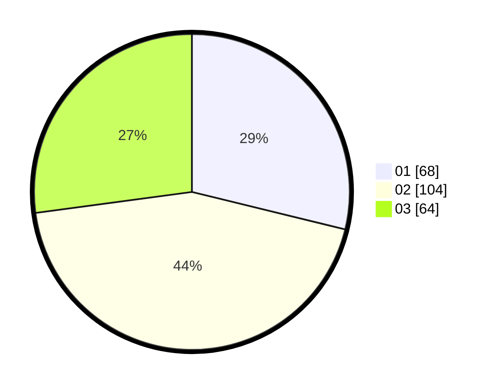

# Hasil

Hasil perolehan suara paslon dapat dilihat pada file paslon-01.txt, paslon-02.txt, dan paslon-03.txt.

Jika tidak ada, artinya data tersebut belum ada pada SIREKAP.

## Perolehan Suara

 * Paslon 01: **68**.
 * Paslon 02: **104**.
 * Paslon 03: **64**.

## Foto C Plano

https://sirekap-obj-formc.kpu.go.id/8a56/pemilu/ppwp/31/73/05/10/05/3173051005074-20240214-192304--66bdfc88-e704-4401-b425-5ed1d9111924.jpg

https://sirekap-obj-formc.kpu.go.id/8a56/pemilu/ppwp/31/73/05/10/05/3173051005074-20240214-192322--344ece9d-d717-4e74-9098-3f3e99ec0c5d.jpg

https://sirekap-obj-formc.kpu.go.id/8a56/pemilu/ppwp/31/73/05/10/05/3173051005074-20240214-192348--af596eac-2b53-402a-a2aa-ebc51b4fd7fb.jpg

## DATA PEMILIH TETAP

Jumlah pemilih dalam DPT: **287**.
 * L: **142**.
 * P: **145**.

## DATA PENGGUNA HAK PILIH

Jumlah pengguna hak pilih dalam DPT: **228**.
 * L: **111**.
 * P: **117**.

Jumlah pengguna hak pilih dalam DPTb: **10**.
 * L: **1**.
 * P: **9**.

Jumlah pengguna hak pilih dalam DPK: **2**.
 * L: **1**.
 * P: **1**.

Jumlah pengguna hak pilih: **240**.
 * L: **113**.
 * P: **127**.

## JUMLAH SUARA SAH DAN TIDAK SAH

JUMLAH SELURUH SUARA SAH: **236**.

JUMLAH SUARA TIDAK SAH: **4**.

JUMLAH SELURUH SUARA SAH DAN SUARA TIDAK SAH: **240**.
