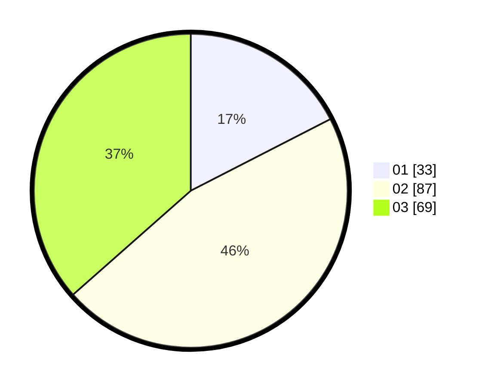

# Hasil

Hasil perolehan suara paslon dapat dilihat pada file paslon-01.txt, paslon-02.txt, dan paslon-03.txt.

Jika tidak ada, artinya data tersebut belum ada pada SIREKAP.

## Perolehan Suara

 * Paslon 01: **33**.
 * Paslon 02: **87**.
 * Paslon 03: **69**.

## Foto C Plano

https://sirekap-obj-formc.kpu.go.id/b188/pemilu/ppwp/31/73/05/10/05/3173051005079-20240214-220510--9033ffbf-b70d-4cf4-ab1e-608422667533.jpg

https://sirekap-obj-formc.kpu.go.id/b188/pemilu/ppwp/31/73/05/10/05/3173051005079-20240214-220619--15bc9092-a940-414b-b33b-be47d21481c0.jpg

https://sirekap-obj-formc.kpu.go.id/b188/pemilu/ppwp/31/73/05/10/05/3173051005079-20240214-220658--b040c92a-6c2d-4774-80e3-710c12abac6a.jpg
