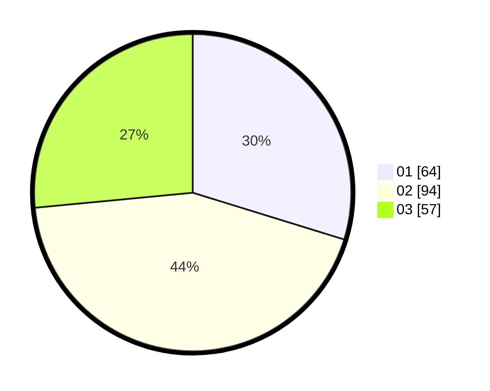

# Hasil

Hasil perolehan suara paslon dapat dilihat pada file paslon-01.txt, paslon-02.txt, dan paslon-03.txt.

Jika tidak ada, artinya data tersebut belum ada pada SIREKAP.

## Perolehan Suara

 * Paslon 01: **64**.
 * Paslon 02: **94**.
 * Paslon 03: **57**.

## Foto C Plano

https://sirekap-obj-formc.kpu.go.id/a277/pemilu/ppwp/31/73/05/10/05/3173051005084-20240214-223740--dc6b07e2-2d28-4d44-80e3-936c6091a180.jpg

https://sirekap-obj-formc.kpu.go.id/a277/pemilu/ppwp/31/73/05/10/05/3173051005084-20240214-225407--196d10e9-3039-496d-8bab-901e1d6db915.jpg

https://sirekap-obj-formc.kpu.go.id/a277/pemilu/ppwp/31/73/05/10/05/3173051005084-20240214-224225--85b38ac2-170a-4496-86ed-17643f8c4ba7.jpg

## DATA PEMILIH TETAP

Jumlah pemilih dalam DPT: **279**.
 * L: **138**.
 * P: **141**.

## DATA PENGGUNA HAK PILIH

Jumlah pengguna hak pilih dalam DPT: **199**.
 * L: **101**.
 * P: **98**.

Jumlah pengguna hak pilih dalam DPTb: **3**.
 * L: **2**.
 * P: **1**.

Jumlah pengguna hak pilih dalam DPK: **16**.
 * L: **4**.
 * P: **12**.

Jumlah pengguna hak pilih: **218**.
 * L: **107**.
 * P: **111**.

## JUMLAH SUARA SAH DAN TIDAK SAH

JUMLAH SELURUH SUARA SAH: **215**.

JUMLAH SUARA TIDAK SAH: **3**.

JUMLAH SELURUH SUARA SAH DAN SUARA TIDAK SAH: **218**.
