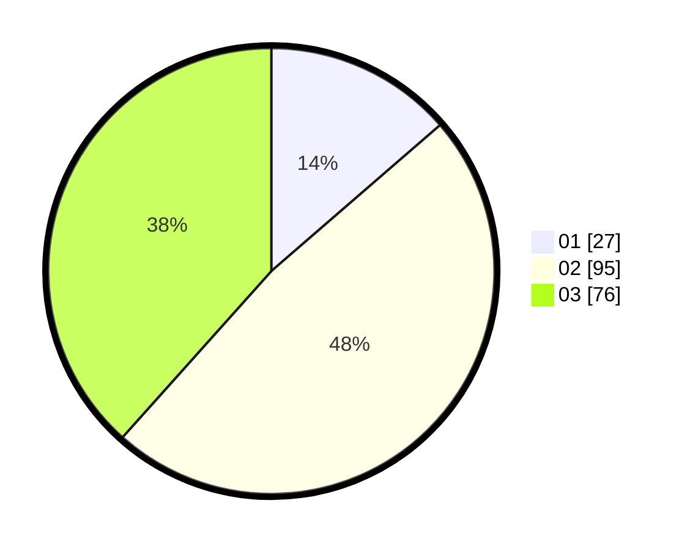

# Hasil

Hasil perolehan suara paslon dapat dilihat pada file paslon-01.txt, paslon-02.txt, dan paslon-03.txt.

Jika tidak ada, artinya data tersebut belum ada pada SIREKAP.

## Perolehan Suara

 * Paslon 01: **27**.
 * Paslon 02: **95**.
 * Paslon 03: **76**.

## Foto C Plano

https://sirekap-obj-formc.kpu.go.id/cac6/pemilu/ppwp/31/73/05/10/05/3173051005087-20240214-212059--d67ef80e-8618-4444-862b-edb7234d6367.jpg

https://sirekap-obj-formc.kpu.go.id/cac6/pemilu/ppwp/31/73/05/10/05/3173051005087-20240214-162224--358b3470-1739-4294-bc2f-54ba5e210d86.jpg

https://sirekap-obj-formc.kpu.go.id/cac6/pemilu/ppwp/31/73/05/10/05/3173051005087-20240214-212233--f0abe44e-6287-4cb7-ab84-a36e8bf4d7d4.jpg

## DATA PEMILIH TETAP

Jumlah pemilih dalam DPT: **202**.
 * L: **104**.
 * P: **98**.

## DATA PENGGUNA HAK PILIH

Jumlah pengguna hak pilih dalam DPT: **190**.
 * L: **99**.
 * P: **91**.

Jumlah pengguna hak pilih dalam DPTb: **1**.
 * L: **1**.
 * P: **0**.

Jumlah pengguna hak pilih dalam DPK: **11**.
 * L: **4**.
 * P: **7**.

Jumlah pengguna hak pilih: **202**.
 * L: **104**.
 * P: **98**.

## JUMLAH SUARA SAH DAN TIDAK SAH

JUMLAH SELURUH SUARA SAH: **198**.

JUMLAH SUARA TIDAK SAH: **4**.

JUMLAH SELURUH SUARA SAH DAN SUARA TIDAK SAH: **202**.
