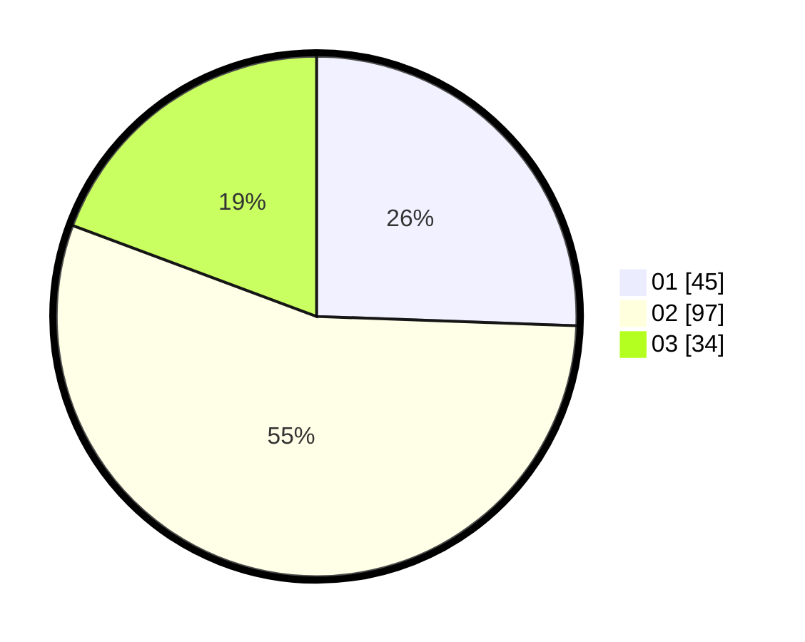

# Hasil

Hasil perolehan suara paslon dapat dilihat pada file paslon-01.txt, paslon-02.txt, dan paslon-03.txt.

Jika tidak ada, artinya data tersebut belum ada pada SIREKAP.

## Perolehan Suara

 * Paslon 01: **45**.
 * Paslon 02: **97**.
 * Paslon 03: **34**.

## Foto C Plano

https://sirekap-obj-formc.kpu.go.id/f150/pemilu/ppwp/31/73/05/10/05/3173051005088-20240214-210502--5723f91b-da54-450f-a108-bd38bd71cbd9.jpg

https://sirekap-obj-formc.kpu.go.id/f150/pemilu/ppwp/31/73/05/10/05/3173051005088-20240214-210608--a20967e6-597c-41a5-b371-22795117680f.jpg

https://sirekap-obj-formc.kpu.go.id/f150/pemilu/ppwp/31/73/05/10/05/3173051005088-20240214-210720--4f06cdf6-4935-4bee-a3fa-89259c8de096.jpg

## DATA PEMILIH TETAP

Jumlah pemilih dalam DPT: **292**.
 * L: **146**.
 * P: **146**.

## DATA PENGGUNA HAK PILIH

Jumlah pengguna hak pilih dalam DPT: **176**.
 * L: **89**.
 * P: **87**.

Jumlah pengguna hak pilih dalam DPTb: **0**.
 * L: **0**.
 * P: **0**.

Jumlah pengguna hak pilih dalam DPK: **0**.
 * L: **0**.
 * P: **0**.

Jumlah pengguna hak pilih: **176**.
 * L: **89**.
 * P: **87**.

## JUMLAH SUARA SAH DAN TIDAK SAH

JUMLAH SELURUH SUARA SAH: **176**.

JUMLAH SUARA TIDAK SAH: **0**.

JUMLAH SELURUH SUARA SAH DAN SUARA TIDAK SAH: **176**.
