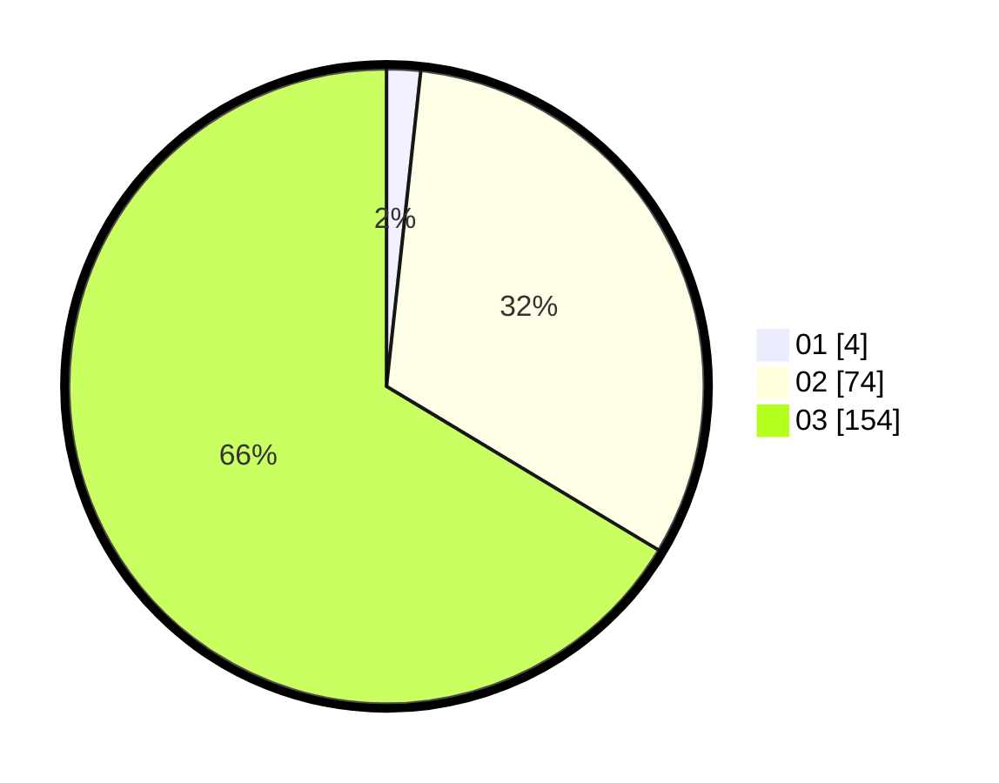

# Hasil

Hasil perolehan suara paslon dapat dilihat pada file paslon-01.txt, paslon-02.txt, dan paslon-03.txt.

Jika tidak ada, artinya data tersebut belum ada pada SIREKAP.

## Perolehan Suara

 * Paslon 01: **4**.
 * Paslon 02: **74**.
 * Paslon 03: **154**.

## Foto C Plano

https://sirekap-obj-formc.kpu.go.id/04fe/pemilu/ppwp/31/73/05/10/05/3173051005094-20240214-224858--41383319-44a5-4a90-90be-90623fa758e6.jpg

https://sirekap-obj-formc.kpu.go.id/04fe/pemilu/ppwp/31/73/05/10/05/3173051005094-20240214-191435--1d27c8a1-4875-4cd3-bccd-7247b90d614a.jpg

https://sirekap-obj-formc.kpu.go.id/04fe/pemilu/ppwp/31/73/05/10/05/3173051005094-20240214-191441--ab4fd01f-a2d7-41fd-9c40-20e8ab18ab89.jpg
