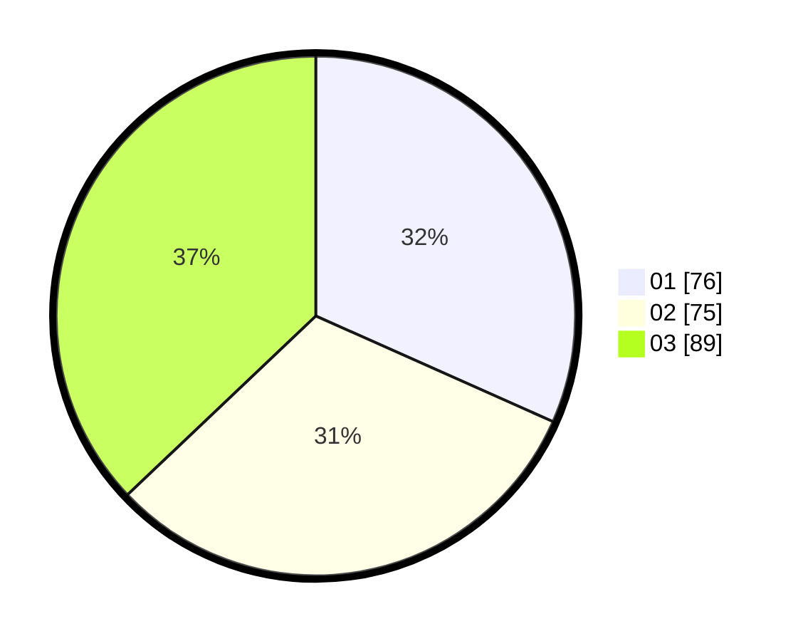

# Hasil

Hasil perolehan suara paslon dapat dilihat pada file paslon-01.txt, paslon-02.txt, dan paslon-03.txt.

Jika tidak ada, artinya data tersebut belum ada pada SIREKAP.

## Perolehan Suara

 * Paslon 01: **76**.
 * Paslon 02: **75**.
 * Paslon 03: **89**.

## Foto C Plano

https://sirekap-obj-formc.kpu.go.id/30dc/pemilu/ppwp/31/73/05/10/05/3173051005104-20240215-001340--6134f6b0-8f2d-4257-9281-9197e9b7ef66.jpg

https://sirekap-obj-formc.kpu.go.id/30dc/pemilu/ppwp/31/73/05/10/05/3173051005104-20240215-001835--af47d7e7-90e2-4874-b8db-57451ab85ad7.jpg

https://sirekap-obj-formc.kpu.go.id/30dc/pemilu/ppwp/31/73/05/10/05/3173051005104-20240215-002057--7897c72a-f90a-43e8-9eee-a153e3515a65.jpg
