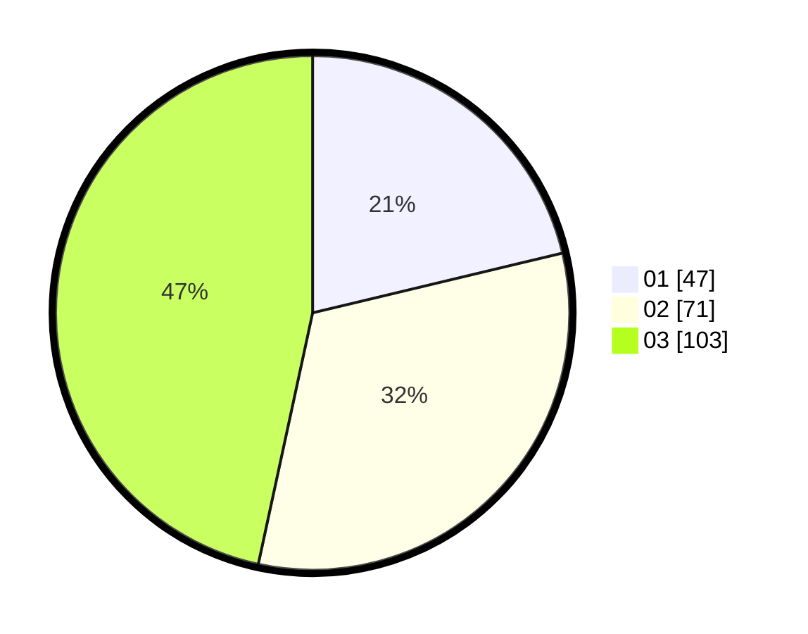

# Hasil

Hasil perolehan suara paslon dapat dilihat pada file paslon-01.txt, paslon-02.txt, dan paslon-03.txt.

Jika tidak ada, artinya data tersebut belum ada pada SIREKAP.

## Perolehan Suara

 * Paslon 01: **47**.
 * Paslon 02: **71**.
 * Paslon 03: **103**.

## Foto C Plano

https://sirekap-obj-formc.kpu.go.id/8d90/pemilu/ppwp/31/73/05/10/05/3173051005107-20240214-185823--4153e8d0-dd68-47c2-8348-e510e62605c8.jpg

https://sirekap-obj-formc.kpu.go.id/8d90/pemilu/ppwp/31/73/05/10/05/3173051005107-20240214-185818--19b1a454-ac50-43e2-a393-f3876bb77ed1.jpg

https://sirekap-obj-formc.kpu.go.id/8d90/pemilu/ppwp/31/73/05/10/05/3173051005107-20240214-185826--4b675087-345d-448e-80ba-ce221e13f3e6.jpg

## DATA PEMILIH TETAP

Jumlah pemilih dalam DPT: **278**.
 * L: **128**.
 * P: **150**.

## DATA PENGGUNA HAK PILIH

Jumlah pengguna hak pilih dalam DPT: **227**.
 * L: **100**.
 * P: **127**.

Jumlah pengguna hak pilih dalam DPTb: **0**.
 * L: **0**.
 * P: **0**.

Jumlah pengguna hak pilih dalam DPK: **2**.
 * L: **1**.
 * P: **1**.

Jumlah pengguna hak pilih: **229**.
 * L: **101**.
 * P: **128**.

## JUMLAH SUARA SAH DAN TIDAK SAH

JUMLAH SELURUH SUARA SAH: **221**.

JUMLAH SUARA TIDAK SAH: **8**.

JUMLAH SELURUH SUARA SAH DAN SUARA TIDAK SAH: **229**.
