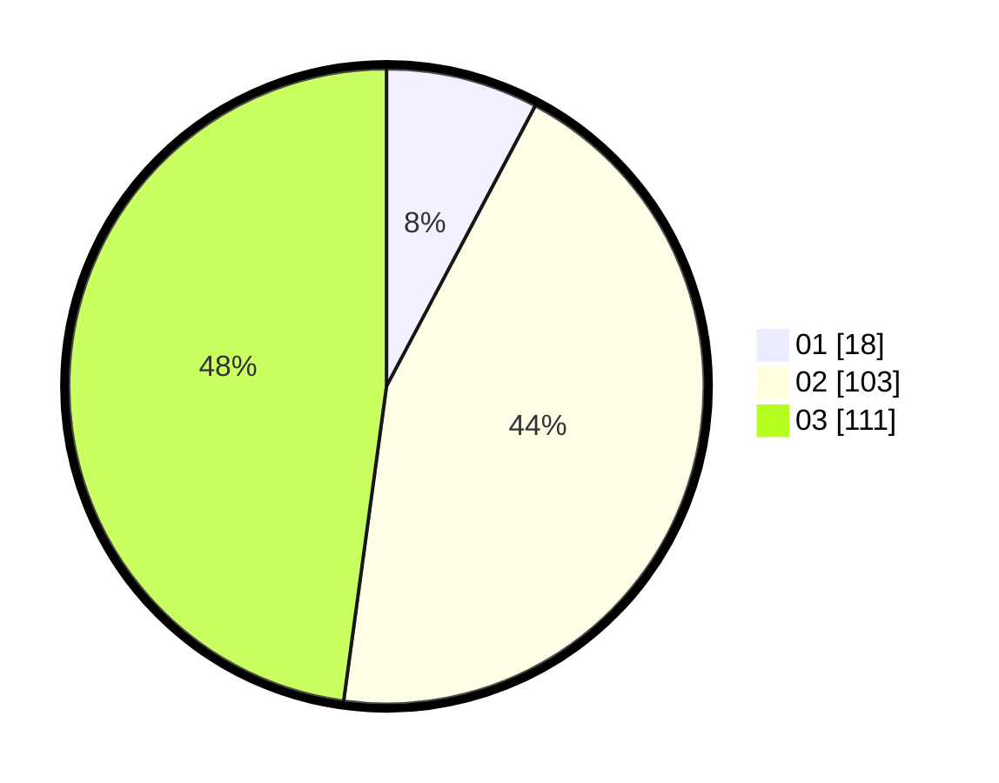

# Hasil

Hasil perolehan suara paslon dapat dilihat pada file paslon-01.txt, paslon-02.txt, dan paslon-03.txt.

Jika tidak ada, artinya data tersebut belum ada pada SIREKAP.

## Perolehan Suara

 * Paslon 01: **18**.
 * Paslon 02: **103**.
 * Paslon 03: **111**.

## Foto C Plano

https://sirekap-obj-formc.kpu.go.id/4dd7/pemilu/ppwp/31/73/05/10/05/3173051005110-20240214-222512--08f9e8b6-f7d8-44de-8f9e-7fe1ba2dfa97.jpg

https://sirekap-obj-formc.kpu.go.id/4dd7/pemilu/ppwp/31/73/05/10/05/3173051005110-20240214-222527--cd0b7e46-a76c-4d5d-9785-d9b78a058a77.jpg

https://sirekap-obj-formc.kpu.go.id/4dd7/pemilu/ppwp/31/73/05/10/05/3173051005110-20240214-222550--b725e7c2-074e-462c-86bc-f1c8c966019a.jpg
