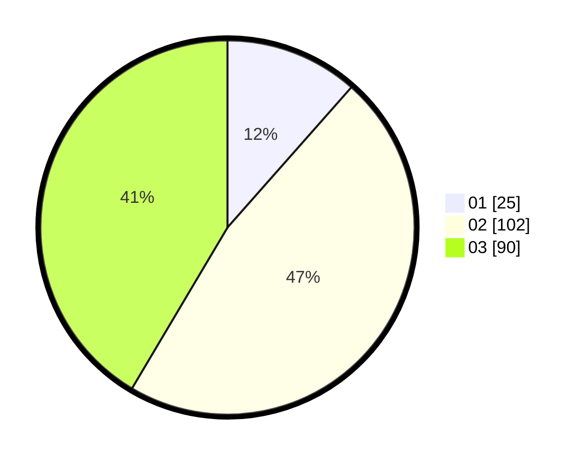

# Hasil

Hasil perolehan suara paslon dapat dilihat pada file paslon-01.txt, paslon-02.txt, dan paslon-03.txt.

Jika tidak ada, artinya data tersebut belum ada pada SIREKAP.

## Perolehan Suara

 * Paslon 01: **25**.
 * Paslon 02: **102**.
 * Paslon 03: **90**.

## Foto C Plano

https://sirekap-obj-formc.kpu.go.id/b0c3/pemilu/ppwp/31/73/05/10/05/3173051005112-20240214-190635--ae13723c-b594-47a7-a087-07e22948fee6.jpg

https://sirekap-obj-formc.kpu.go.id/b0c3/pemilu/ppwp/31/73/05/10/05/3173051005112-20240214-192722--809e33d0-b3f8-4afb-a456-9da3e61d2646.jpg

https://sirekap-obj-formc.kpu.go.id/b0c3/pemilu/ppwp/31/73/05/10/05/3173051005112-20240214-191655--373727b6-1658-4ac2-a4f3-28328ee5f664.jpg

## DATA PEMILIH TETAP

Jumlah pemilih dalam DPT: **294**.
 * L: **137**.
 * P: **157**.

## DATA PENGGUNA HAK PILIH

Jumlah pengguna hak pilih dalam DPT: **214**.
 * L: **96**.
 * P: **118**.

Jumlah pengguna hak pilih dalam DPTb: **2**.
 * L: **2**.
 * P: **0**.

Jumlah pengguna hak pilih dalam DPK: **11**.
 * L: **4**.
 * P: **7**.

Jumlah pengguna hak pilih: **227**.
 * L: **102**.
 * P: **125**.

## JUMLAH SUARA SAH DAN TIDAK SAH

JUMLAH SELURUH SUARA SAH: **217**.

JUMLAH SUARA TIDAK SAH: **10**.

JUMLAH SELURUH SUARA SAH DAN SUARA TIDAK SAH: **227**.
