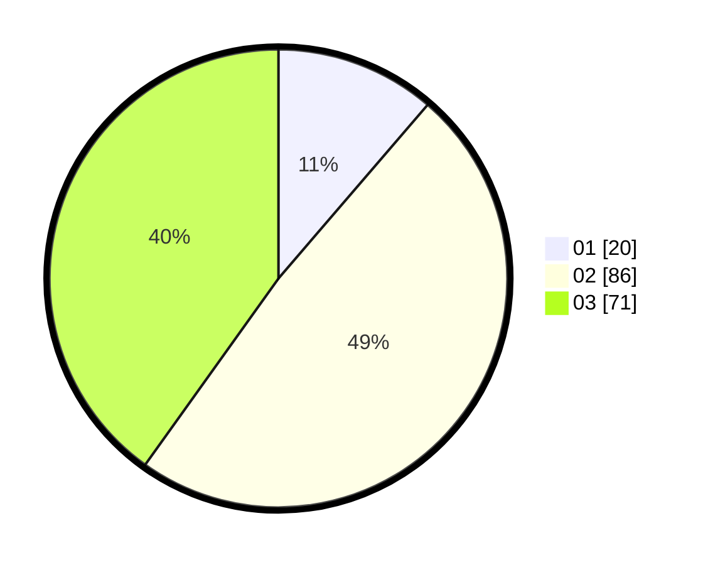

# Hasil

Hasil perolehan suara paslon dapat dilihat pada file paslon-01.txt, paslon-02.txt, dan paslon-03.txt.

Jika tidak ada, artinya data tersebut belum ada pada SIREKAP.

## Perolehan Suara

 * Paslon 01: **20**.
 * Paslon 02: **86**.
 * Paslon 03: **71**.

## Foto C Plano

https://sirekap-obj-formc.kpu.go.id/7224/pemilu/ppwp/31/73/05/10/05/3173051005113-20240214-230044--dd296b38-fd5c-4164-a969-bd68fc08d836.jpg

https://sirekap-obj-formc.kpu.go.id/7224/pemilu/ppwp/31/73/05/10/05/3173051005113-20240214-200603--521721ca-2911-46c7-a5a3-e4c313b7acac.jpg

https://sirekap-obj-formc.kpu.go.id/7224/pemilu/ppwp/31/73/05/10/05/3173051005113-20240214-205345--128375e5-d0dc-4f26-b0e7-d011b88fa1ee.jpg
