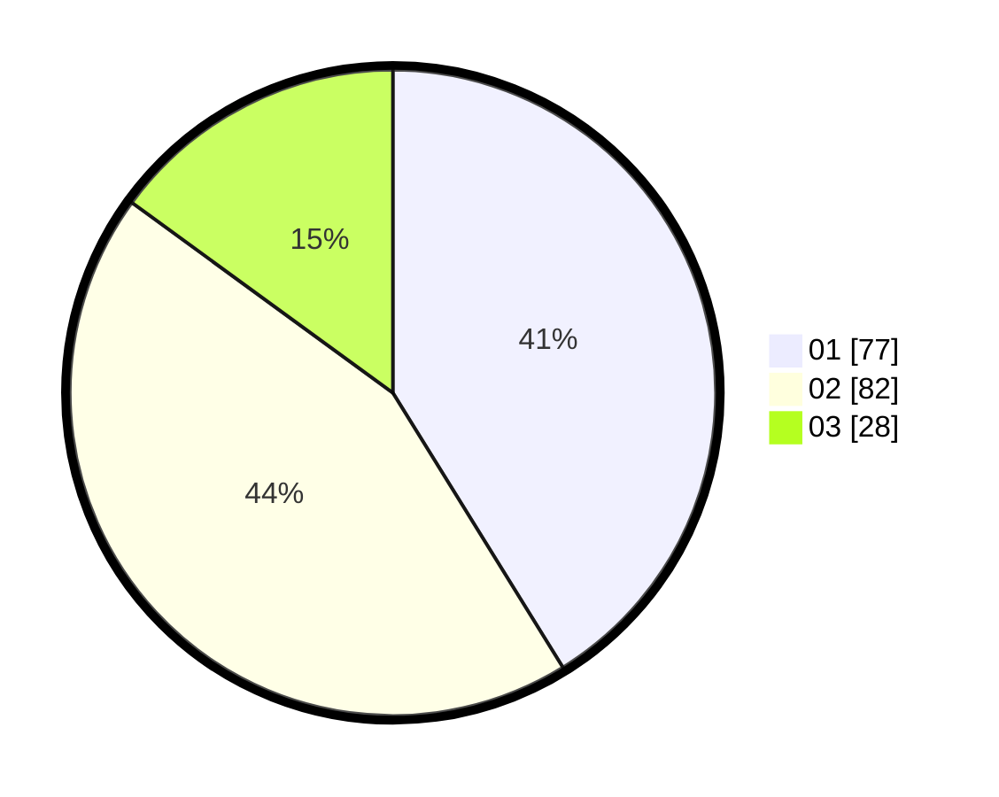

# Hasil

Hasil perolehan suara paslon dapat dilihat pada file paslon-01.txt, paslon-02.txt, dan paslon-03.txt.

Jika tidak ada, artinya data tersebut belum ada pada SIREKAP.

## Perolehan Suara

 * Paslon 01: **77**.
 * Paslon 02: **82**.
 * Paslon 03: **28**.

## Foto C Plano

https://sirekap-obj-formc.kpu.go.id/a9e2/pemilu/ppwp/31/73/05/10/05/3173051005114-20240214-185907--763de73c-ab16-41b6-b058-57de73ef0d15.jpg

https://sirekap-obj-formc.kpu.go.id/a9e2/pemilu/ppwp/31/73/05/10/05/3173051005114-20240214-212149--7b3dbef4-1394-4620-9cdb-cbb55d4e83a9.jpg

https://sirekap-obj-formc.kpu.go.id/a9e2/pemilu/ppwp/31/73/05/10/05/3173051005114-20240214-202740--b9a65cbd-06ad-4294-a654-a6a999048000.jpg

## DATA PEMILIH TETAP

Jumlah pemilih dalam DPT: **251**.
 * L: **133**.
 * P: **118**.

## DATA PENGGUNA HAK PILIH

Jumlah pengguna hak pilih dalam DPT: **185**.
 * L: **92**.
 * P: **93**.

Jumlah pengguna hak pilih dalam DPTb: **4**.
 * L: **3**.
 * P: **1**.

Jumlah pengguna hak pilih dalam DPK: **0**.
 * L: **0**.
 * P: **0**.

Jumlah pengguna hak pilih: **189**.
 * L: **95**.
 * P: **94**.

## JUMLAH SUARA SAH DAN TIDAK SAH

JUMLAH SELURUH SUARA SAH: **187**.

JUMLAH SUARA TIDAK SAH: **2**.

JUMLAH SELURUH SUARA SAH DAN SUARA TIDAK SAH: **189**.
