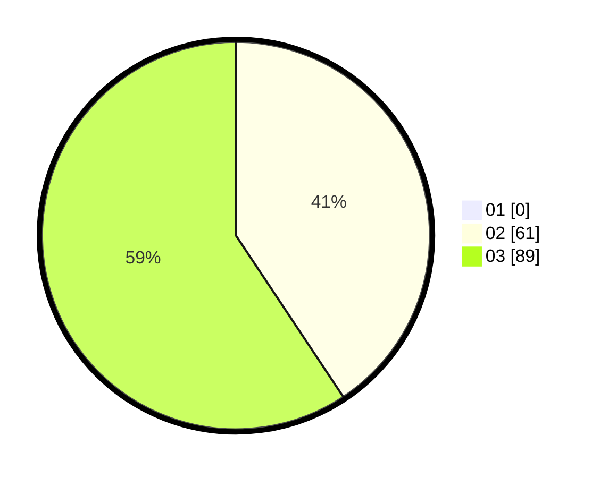

# Hasil

Hasil perolehan suara paslon dapat dilihat pada file paslon-01.txt, paslon-02.txt, dan paslon-03.txt.

Jika tidak ada, artinya data tersebut belum ada pada SIREKAP.

## Perolehan Suara

 * Paslon 01: **0**.
 * Paslon 02: **61**.
 * Paslon 03: **89**.

## Foto C Plano

https://sirekap-obj-formc.kpu.go.id/376d/pemilu/ppwp/31/73/05/10/05/3173051005117-20240214-205500--50c6c9c9-63fa-4e1c-9258-8b6a086a069d.jpg

https://sirekap-obj-formc.kpu.go.id/376d/pemilu/ppwp/31/73/05/10/05/3173051005117-20240214-205636--380517a1-24a2-4c47-bb94-fab92693e076.jpg

https://sirekap-obj-formc.kpu.go.id/376d/pemilu/ppwp/31/73/05/10/05/3173051005117-20240214-205751--dc98ffc1-3f67-4148-b51d-bedd25fdb569.jpg
