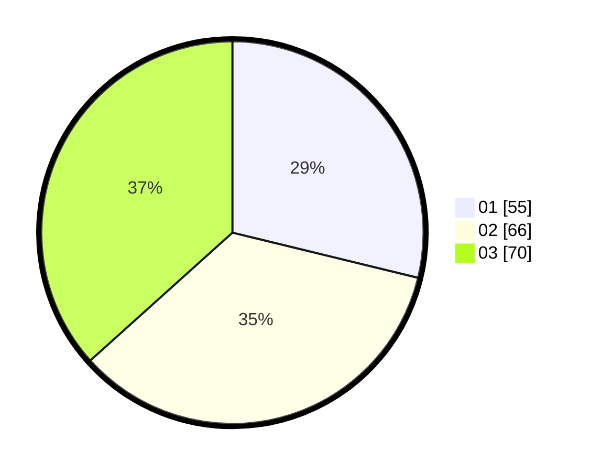

# Hasil

Hasil perolehan suara paslon dapat dilihat pada file paslon-01.txt, paslon-02.txt, dan paslon-03.txt.

Jika tidak ada, artinya data tersebut belum ada pada SIREKAP.

## Perolehan Suara

 * Paslon 01: **55**.
 * Paslon 02: **66**.
 * Paslon 03: **70**.

## Foto C Plano

https://sirekap-obj-formc.kpu.go.id/e65c/pemilu/ppwp/31/73/05/10/05/3173051005119-20240214-201512--6234517c-c496-46cc-b87a-72883c05135f.jpg

https://sirekap-obj-formc.kpu.go.id/e65c/pemilu/ppwp/31/73/05/10/05/3173051005119-20240214-201525--15710c2c-4747-4447-b562-386543539fb8.jpg

https://sirekap-obj-formc.kpu.go.id/e65c/pemilu/ppwp/31/73/05/10/05/3173051005119-20240214-201531--743cc458-d5c7-435b-9971-3a3585145a42.jpg

## DATA PEMILIH TETAP

Jumlah pemilih dalam DPT: **226**.
 * L: **112**.
 * P: **114**.

## DATA PENGGUNA HAK PILIH

Jumlah pengguna hak pilih dalam DPT: **188**.
 * L: **91**.
 * P: **97**.

Jumlah pengguna hak pilih dalam DPTb: **0**.
 * L: **0**.
 * P: **0**.

Jumlah pengguna hak pilih dalam DPK: **3**.
 * L: **1**.
 * P: **2**.

Jumlah pengguna hak pilih: **191**.
 * L: **92**.
 * P: **99**.

## JUMLAH SUARA SAH DAN TIDAK SAH

JUMLAH SELURUH SUARA SAH: **191**.

JUMLAH SUARA TIDAK SAH: **0**.

JUMLAH SELURUH SUARA SAH DAN SUARA TIDAK SAH: **191**.
