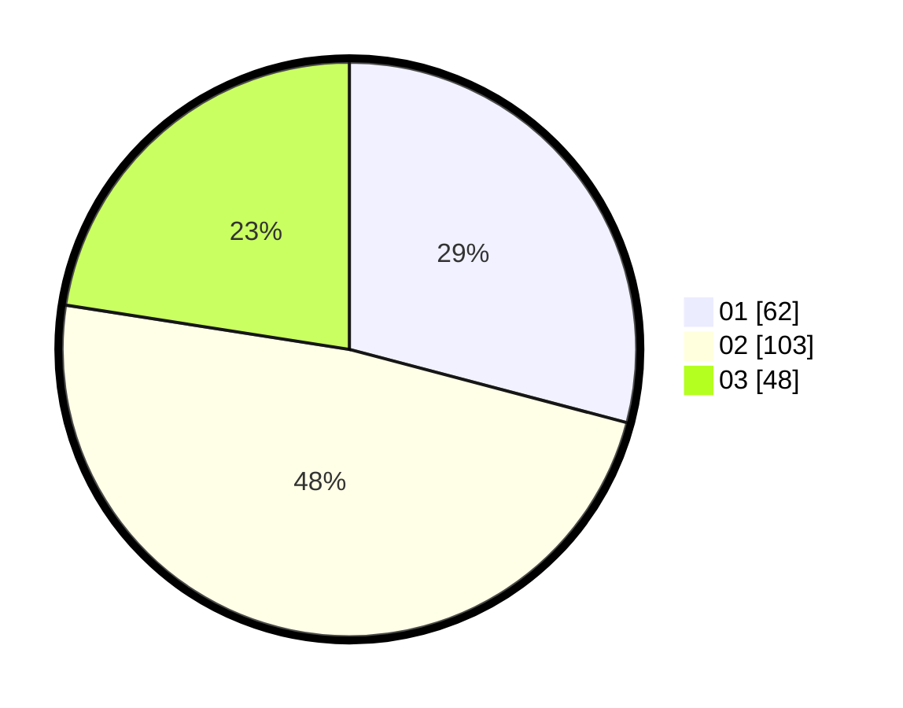

# Hasil

Hasil perolehan suara paslon dapat dilihat pada file paslon-01.txt, paslon-02.txt, dan paslon-03.txt.

Jika tidak ada, artinya data tersebut belum ada pada SIREKAP.

## Perolehan Suara

 * Paslon 01: **62**.
 * Paslon 02: **103**.
 * Paslon 03: **48**.

## Foto C Plano

https://sirekap-obj-formc.kpu.go.id/07bb/pemilu/ppwp/31/73/05/10/05/3173051005122-20240214-155036--bedf224b-91ae-4cb3-8005-65ac4339b0b3.jpg

https://sirekap-obj-formc.kpu.go.id/07bb/pemilu/ppwp/31/73/05/10/05/3173051005122-20240214-155920--44029cb3-63de-498a-adf2-34e409528960.jpg

https://sirekap-obj-formc.kpu.go.id/07bb/pemilu/ppwp/31/73/05/10/05/3173051005122-20240214-155616--b6d3404f-e41d-487f-8562-992bfb078fbb.jpg

## DATA PEMILIH TETAP

Jumlah pemilih dalam DPT: **275**.
 * L: **146**.
 * P: **129**.

## DATA PENGGUNA HAK PILIH

Jumlah pengguna hak pilih dalam DPT: **213**.
 * L: **107**.
 * P: **106**.

Jumlah pengguna hak pilih dalam DPTb: **0**.
 * L: **0**.
 * P: **0**.

Jumlah pengguna hak pilih dalam DPK: **2**.
 * L: **1**.
 * P: **1**.

Jumlah pengguna hak pilih: **215**.
 * L: **108**.
 * P: **107**.

## JUMLAH SUARA SAH DAN TIDAK SAH

JUMLAH SELURUH SUARA SAH: **213**.

JUMLAH SUARA TIDAK SAH: **2**.

JUMLAH SELURUH SUARA SAH DAN SUARA TIDAK SAH: **215**.
