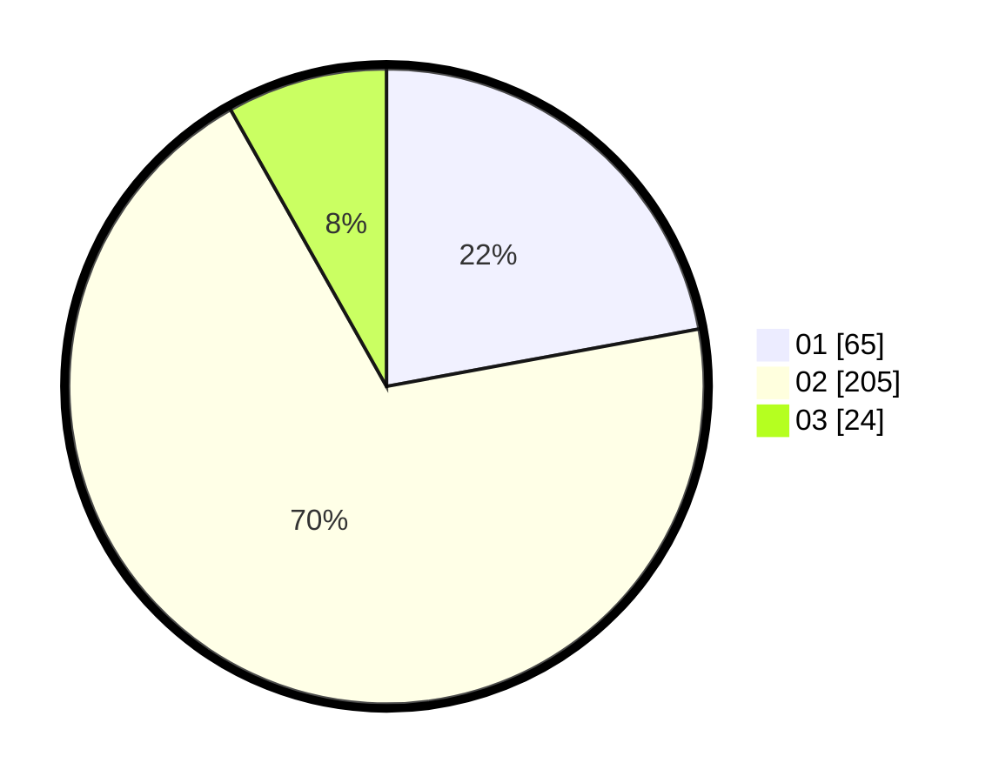

# Hasil

Hasil perolehan suara paslon dapat dilihat pada file paslon-01.txt, paslon-02.txt, dan paslon-03.txt.

Jika tidak ada, artinya data tersebut belum ada pada SIREKAP.

## Perolehan Suara

 * Paslon 01: **65**.
 * Paslon 02: **205**.
 * Paslon 03: **24**.

## Foto C Plano

https://sirekap-obj-formc.kpu.go.id/2f18/pemilu/ppwp/31/73/05/10/05/3173051005123-20240214-223919--e9274587-c070-4ad3-81f4-b0d099bad599.jpg

https://sirekap-obj-formc.kpu.go.id/2f18/pemilu/ppwp/31/73/05/10/05/3173051005123-20240214-184546--f08e6526-95fd-41a7-8a9c-e2afeaa40f0b.jpg

https://sirekap-obj-formc.kpu.go.id/2f18/pemilu/ppwp/31/73/05/10/05/3173051005123-20240214-223930--18459a5a-5dce-4a5f-93ed-819c380ca2b2.jpg

## DATA PEMILIH TETAP

Jumlah pemilih dalam DPT: **279**.
 * L: **135**.
 * P: **144**.

## DATA PENGGUNA HAK PILIH

Jumlah pengguna hak pilih dalam DPT: **209**.
 * L: **94**.
 * P: **115**.

Jumlah pengguna hak pilih dalam DPTb: **0**.
 * L: **0**.
 * P: **0**.

Jumlah pengguna hak pilih dalam DPK: **1**.
 * L: **0**.
 * P: **1**.

Jumlah pengguna hak pilih: **210**.
 * L: **94**.
 * P: **116**.

## JUMLAH SUARA SAH DAN TIDAK SAH

JUMLAH SELURUH SUARA SAH: **205**.

JUMLAH SUARA TIDAK SAH: **5**.

JUMLAH SELURUH SUARA SAH DAN SUARA TIDAK SAH: **210**.
