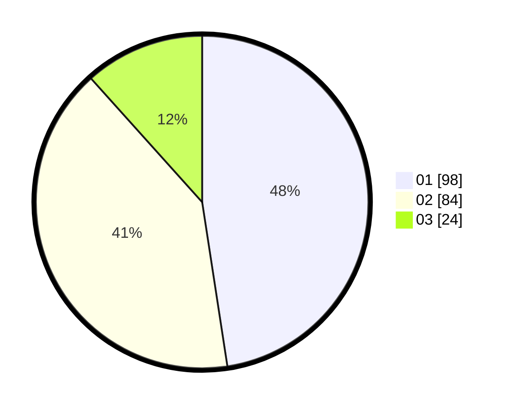

# Hasil

Hasil perolehan suara paslon dapat dilihat pada file paslon-01.txt, paslon-02.txt, dan paslon-03.txt.

Jika tidak ada, artinya data tersebut belum ada pada SIREKAP.

## Perolehan Suara

 * Paslon 01: **98**.
 * Paslon 02: **84**.
 * Paslon 03: **24**.

## Foto C Plano

https://sirekap-obj-formc.kpu.go.id/95c7/pemilu/ppwp/31/73/05/10/05/3173051005125-20240216-135256--baccda99-5c16-430a-a0ac-3512be351f9a.jpg

https://sirekap-obj-formc.kpu.go.id/95c7/pemilu/ppwp/31/73/05/10/05/3173051005125-20240216-135258--53bb00c0-2966-474a-b996-d89e7f2afc52.jpg

https://sirekap-obj-formc.kpu.go.id/95c7/pemilu/ppwp/31/73/05/10/05/3173051005125-20240216-135257--44d7225f-c192-4538-9d24-c032706f616d.jpg

## DATA PEMILIH TETAP

Jumlah pemilih dalam DPT: **292**.
 * L: **151**.
 * P: **141**.

## DATA PENGGUNA HAK PILIH

Jumlah pengguna hak pilih dalam DPT: **210**.
 * L: **111**.
 * P: **99**.

Jumlah pengguna hak pilih dalam DPTb: **1**.
 * L: **0**.
 * P: **1**.

Jumlah pengguna hak pilih dalam DPK: **0**.
 * L: **0**.
 * P: **0**.

Jumlah pengguna hak pilih: **211**.
 * L: **111**.
 * P: **100**.

## JUMLAH SUARA SAH DAN TIDAK SAH

JUMLAH SELURUH SUARA SAH: **206**.

JUMLAH SUARA TIDAK SAH: **5**.

JUMLAH SELURUH SUARA SAH DAN SUARA TIDAK SAH: **211**.
