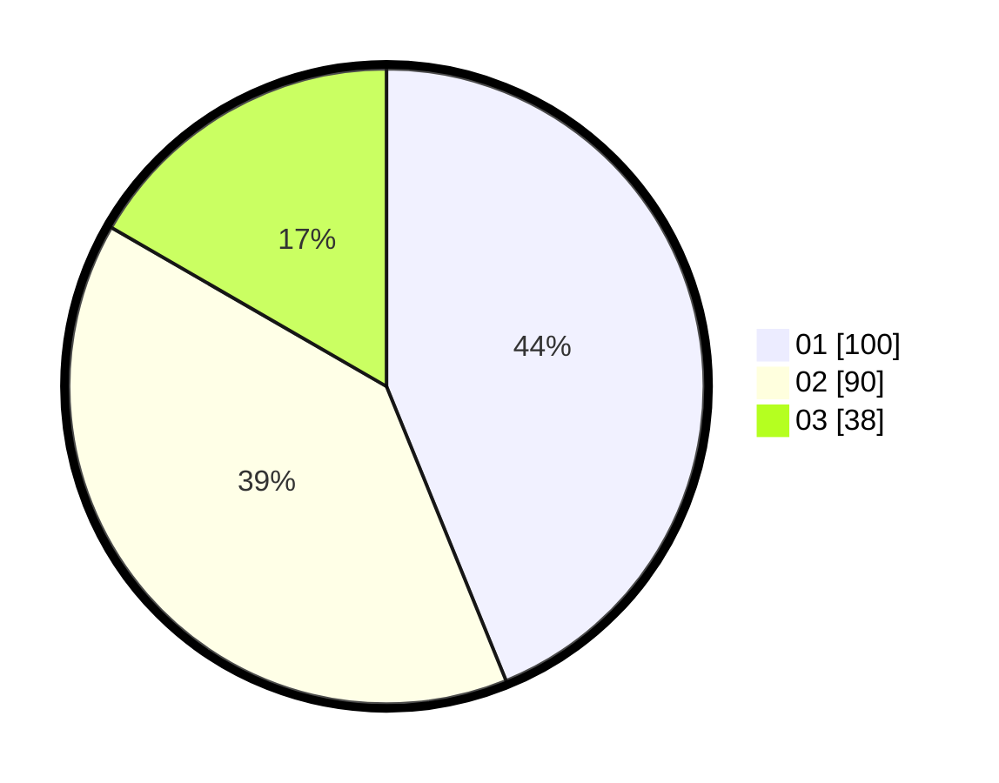

# Hasil

Hasil perolehan suara paslon dapat dilihat pada file paslon-01.txt, paslon-02.txt, dan paslon-03.txt.

Jika tidak ada, artinya data tersebut belum ada pada SIREKAP.

## Perolehan Suara

 * Paslon 01: **100**.
 * Paslon 02: **90**.
 * Paslon 03: **38**.

## Foto C Plano

https://sirekap-obj-formc.kpu.go.id/2799/pemilu/ppwp/31/73/05/10/05/3173051005134-20240214-232810--d954d089-410f-4683-beb7-bf877c9fb40f.jpg

https://sirekap-obj-formc.kpu.go.id/2799/pemilu/ppwp/31/73/05/10/05/3173051005134-20240214-232826--a0a52a42-b5c1-40a6-989d-50be7e55fb79.jpg

https://sirekap-obj-formc.kpu.go.id/2799/pemilu/ppwp/31/73/05/10/05/3173051005134-20240214-233006--ec19e890-29da-4cc0-9d2a-b3dcd901090c.jpg

## DATA PEMILIH TETAP

Jumlah pemilih dalam DPT: **288**.
 * L: **146**.
 * P: **142**.

## DATA PENGGUNA HAK PILIH

Jumlah pengguna hak pilih dalam DPT: **226**.
 * L: **110**.
 * P: **116**.

Jumlah pengguna hak pilih dalam DPTb: **3**.
 * L: **1**.
 * P: **2**.

Jumlah pengguna hak pilih dalam DPK: **3**.
 * L: **1**.
 * P: **2**.

Jumlah pengguna hak pilih: **232**.
 * L: **112**.
 * P: **120**.

## JUMLAH SUARA SAH DAN TIDAK SAH

JUMLAH SELURUH SUARA SAH: **228**.

JUMLAH SUARA TIDAK SAH: **4**.

JUMLAH SELURUH SUARA SAH DAN SUARA TIDAK SAH: **232**.
