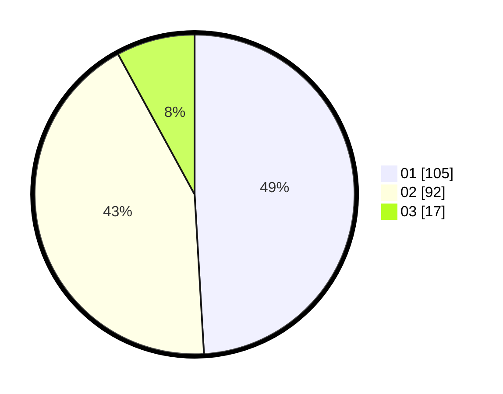

# Hasil

Hasil perolehan suara paslon dapat dilihat pada file paslon-01.txt, paslon-02.txt, dan paslon-03.txt.

Jika tidak ada, artinya data tersebut belum ada pada SIREKAP.

## Perolehan Suara

 * Paslon 01: **105**.
 * Paslon 02: **92**.
 * Paslon 03: **17**.

## Foto C Plano

https://sirekap-obj-formc.kpu.go.id/b3c5/pemilu/ppwp/31/73/05/10/05/3173051005135-20240214-230440--4ae3e66a-35dc-4357-b53f-cf2b0607c449.jpg

https://sirekap-obj-formc.kpu.go.id/b3c5/pemilu/ppwp/31/73/05/10/05/3173051005135-20240214-230651--6b067df7-1d62-4341-9456-63f51bd2863f.jpg

https://sirekap-obj-formc.kpu.go.id/b3c5/pemilu/ppwp/31/73/05/10/05/3173051005135-20240214-231124--055eeff9-b3f6-4b91-af9d-79a1020bed32.jpg
