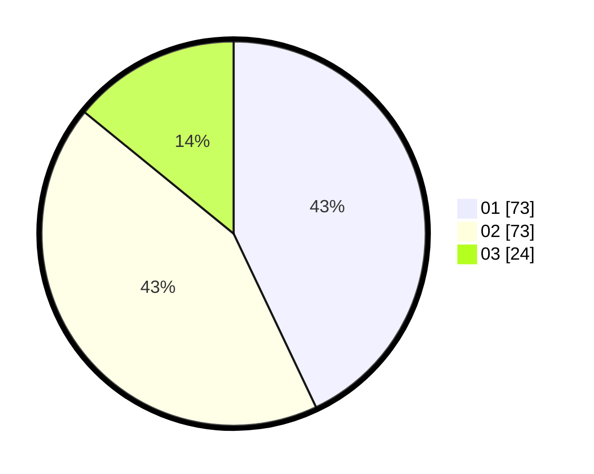

# Hasil

Hasil perolehan suara paslon dapat dilihat pada file paslon-01.txt, paslon-02.txt, dan paslon-03.txt.

Jika tidak ada, artinya data tersebut belum ada pada SIREKAP.

## Perolehan Suara

 * Paslon 01: **73**.
 * Paslon 02: **73**.
 * Paslon 03: **24**.

## Foto C Plano

https://sirekap-obj-formc.kpu.go.id/1706/pemilu/ppwp/31/73/05/10/05/3173051005136-20240214-230143--93393346-a948-40e5-bf48-5cfee725f143.jpg

https://sirekap-obj-formc.kpu.go.id/1706/pemilu/ppwp/31/73/05/10/05/3173051005136-20240214-230310--58458c56-a776-4c91-9c0d-26a46690063b.jpg

https://sirekap-obj-formc.kpu.go.id/1706/pemilu/ppwp/31/73/05/10/05/3173051005136-20240214-230411--6a409706-6e2d-4f16-88fe-926b2ce84af2.jpg
