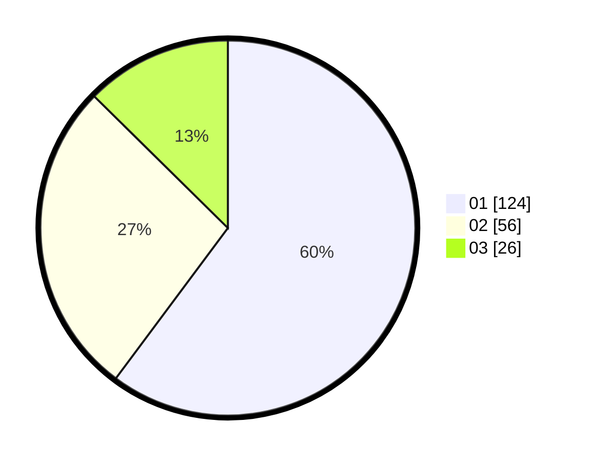

# Hasil

Hasil perolehan suara paslon dapat dilihat pada file paslon-01.txt, paslon-02.txt, dan paslon-03.txt.

Jika tidak ada, artinya data tersebut belum ada pada SIREKAP.

## Perolehan Suara

 * Paslon 01: **124**.
 * Paslon 02: **56**.
 * Paslon 03: **26**.

## Foto C Plano

https://sirekap-obj-formc.kpu.go.id/2098/pemilu/ppwp/31/73/05/10/05/3173051005138-20240215-004931--6d956cf1-4169-430f-913d-7059ee50420d.jpg

https://sirekap-obj-formc.kpu.go.id/2098/pemilu/ppwp/31/73/05/10/05/3173051005138-20240215-004954--37bcdb3b-c5ae-4a1c-96e8-c705ec0089be.jpg

https://sirekap-obj-formc.kpu.go.id/2098/pemilu/ppwp/31/73/05/10/05/3173051005138-20240215-005117--28b36056-5d7e-4459-89da-0d1d5b040bc4.jpg

## DATA PEMILIH TETAP

Jumlah pemilih dalam DPT: **1**.
 * L: **0**.
 * P: **0**.

## DATA PENGGUNA HAK PILIH

Jumlah pengguna hak pilih dalam DPT: **0**.
 * L: **0**.
 * P: **0**.

Jumlah pengguna hak pilih dalam DPTb: **0**.
 * L: **577**.
 * P: **0**.

Jumlah pengguna hak pilih dalam DPK: **2**.
 * L: **2**.
 * P: **0**.

Jumlah pengguna hak pilih: **208**.
 * L: **92**.
 * P: **116**.

## JUMLAH SUARA SAH DAN TIDAK SAH

JUMLAH SELURUH SUARA SAH: **206**.

JUMLAH SUARA TIDAK SAH: **2**.

JUMLAH SELURUH SUARA SAH DAN SUARA TIDAK SAH: **208**.
