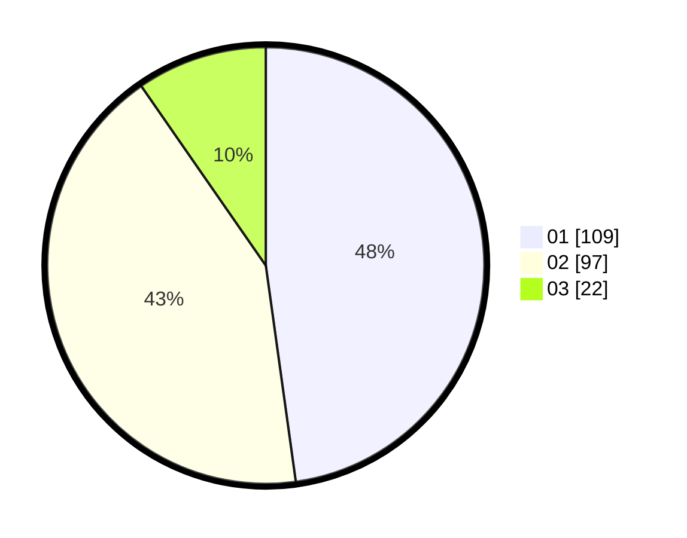

# Hasil

Hasil perolehan suara paslon dapat dilihat pada file paslon-01.txt, paslon-02.txt, dan paslon-03.txt.

Jika tidak ada, artinya data tersebut belum ada pada SIREKAP.

## Perolehan Suara

 * Paslon 01: **109**.
 * Paslon 02: **97**.
 * Paslon 03: **22**.

## Foto C Plano

https://sirekap-obj-formc.kpu.go.id/cb86/pemilu/ppwp/31/73/05/10/05/3173051005142-20240214-224109--b375ccc0-0b81-41c6-bcf5-e56acd8d2991.jpg

https://sirekap-obj-formc.kpu.go.id/cb86/pemilu/ppwp/31/73/05/10/05/3173051005142-20240214-224215--2cc635df-a580-42dc-a39d-519392c1af66.jpg

https://sirekap-obj-formc.kpu.go.id/cb86/pemilu/ppwp/31/73/05/10/05/3173051005142-20240215-004147--7e0ac8d0-b4d6-49be-82e4-88af4a40bace.jpg
