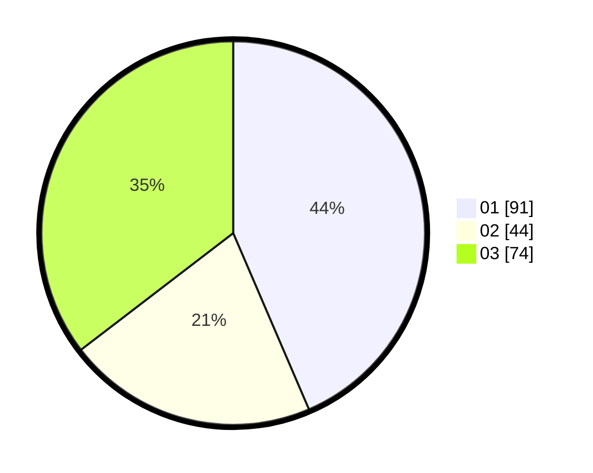

# Hasil

Hasil perolehan suara paslon dapat dilihat pada file paslon-01.txt, paslon-02.txt, dan paslon-03.txt.

Jika tidak ada, artinya data tersebut belum ada pada SIREKAP.

## Perolehan Suara

 * Paslon 01: **91**.
 * Paslon 02: **44**.
 * Paslon 03: **74**.

## Foto C Plano

https://sirekap-obj-formc.kpu.go.id/80ae/pemilu/ppwp/31/73/05/10/05/3173051005143-20240214-222809--a758d12a-b62d-4316-8a7c-a932fc960345.jpg

https://sirekap-obj-formc.kpu.go.id/80ae/pemilu/ppwp/31/73/05/10/05/3173051005143-20240214-222844--8e6a0404-9786-4507-af0c-034c8d2b5813.jpg

https://sirekap-obj-formc.kpu.go.id/80ae/pemilu/ppwp/31/73/05/10/05/3173051005143-20240214-223104--b76cc144-63f0-4bbc-8ad9-267569a63e8b.jpg
