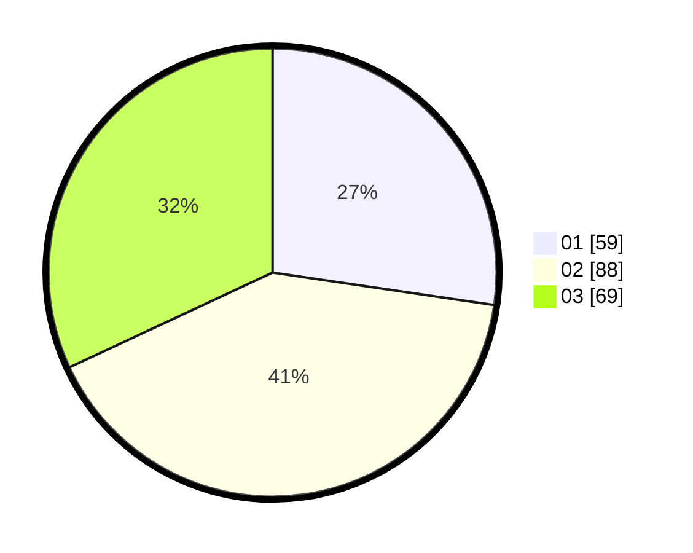

# Hasil

Hasil perolehan suara paslon dapat dilihat pada file paslon-01.txt, paslon-02.txt, dan paslon-03.txt.

Jika tidak ada, artinya data tersebut belum ada pada SIREKAP.

## Perolehan Suara

 * Paslon 01: **59**.
 * Paslon 02: **88**.
 * Paslon 03: **69**.

## Foto C Plano

https://sirekap-obj-formc.kpu.go.id/8901/pemilu/ppwp/31/73/05/10/05/3173051005147-20240215-000155--6897db3f-b206-4022-a20b-d6c0b741e1af.jpg

https://sirekap-obj-formc.kpu.go.id/8901/pemilu/ppwp/31/73/05/10/05/3173051005147-20240215-000232--ab66b64d-5b83-47dc-b25a-8e54dba110d9.jpg

https://sirekap-obj-formc.kpu.go.id/8901/pemilu/ppwp/31/73/05/10/05/3173051005147-20240215-000320--4c40a1a8-83ac-4f9f-affc-2dad4401f5d0.jpg
