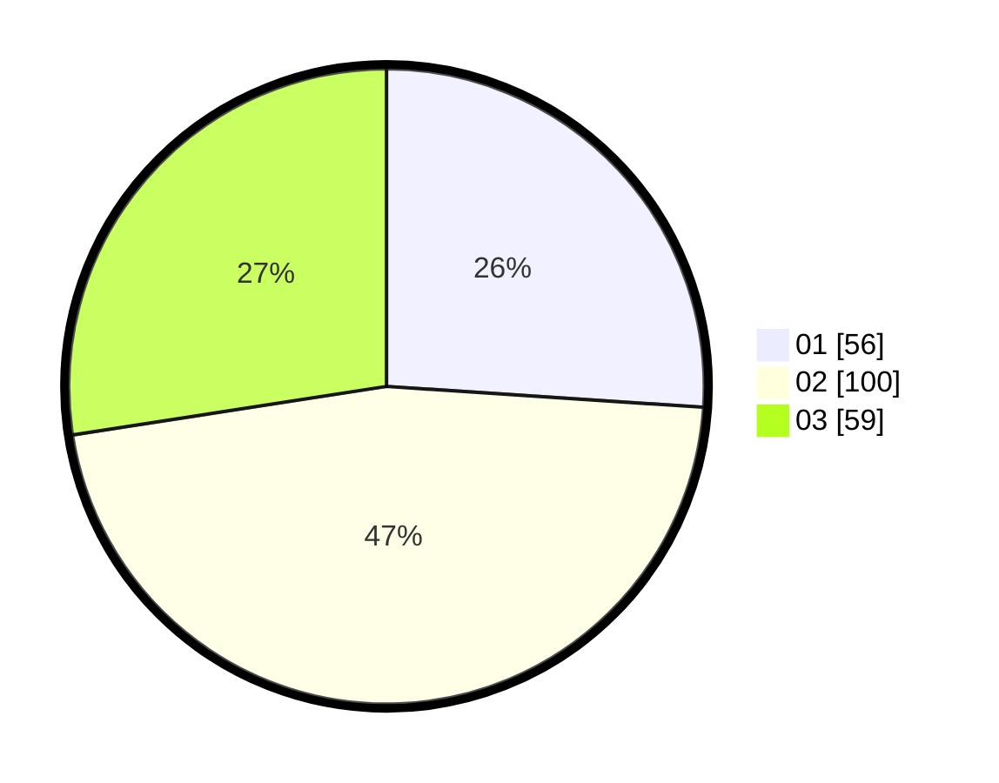

# Hasil

Hasil perolehan suara paslon dapat dilihat pada file paslon-01.txt, paslon-02.txt, dan paslon-03.txt.

Jika tidak ada, artinya data tersebut belum ada pada SIREKAP.

## Perolehan Suara

 * Paslon 01: **56**.
 * Paslon 02: **100**.
 * Paslon 03: **59**.

## Foto C Plano

https://sirekap-obj-formc.kpu.go.id/67a5/pemilu/ppwp/31/73/05/10/05/3173051005148-20240215-003311--ecbc116c-0f2c-403b-afe1-c6a186c94f7b.jpg

https://sirekap-obj-formc.kpu.go.id/67a5/pemilu/ppwp/31/73/05/10/05/3173051005148-20240215-003358--8fa9dac9-ec87-4144-80f3-73ce0d399e7c.jpg

https://sirekap-obj-formc.kpu.go.id/67a5/pemilu/ppwp/31/73/05/10/05/3173051005148-20240215-003455--5aefd125-df34-4c37-8190-6c185b5b350c.jpg
